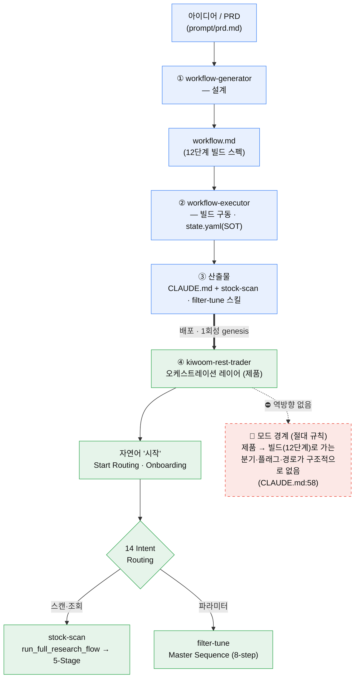
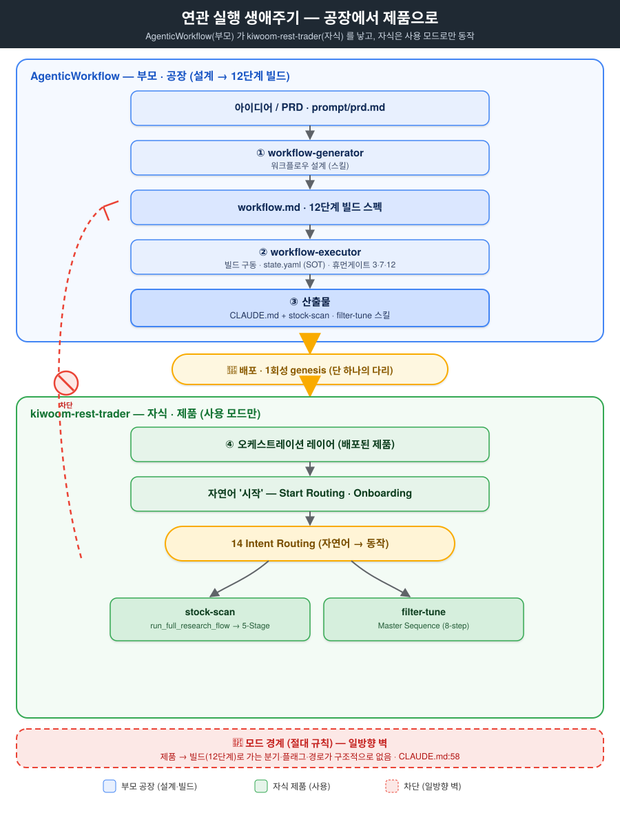
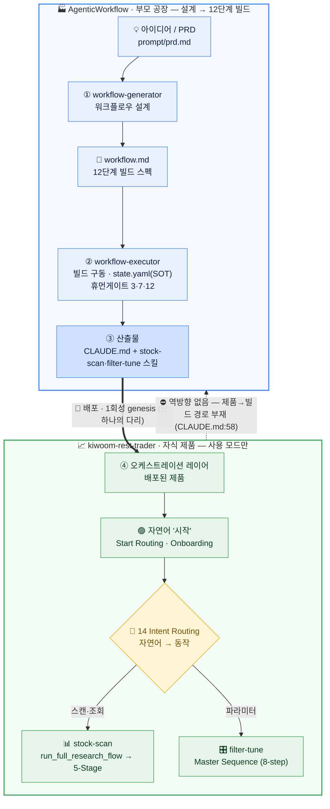
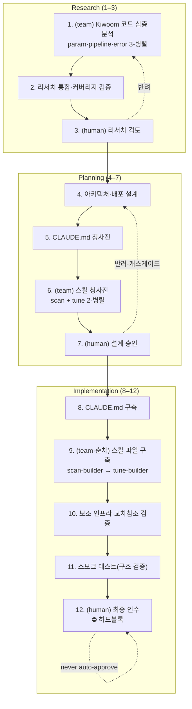
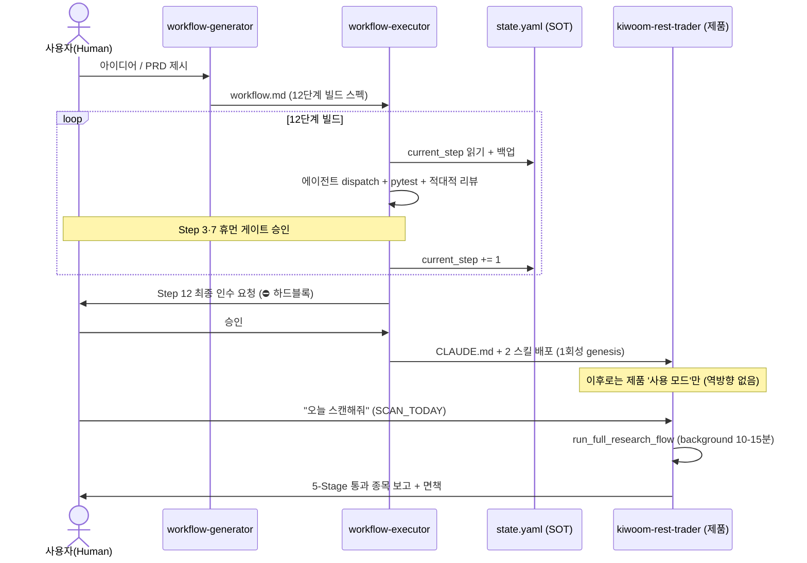

# 통합 사용자 명령어 매뉴얼 (Integrated User-Command Manual)

> **두 프로젝트를 하나로**: 워크플로우를 **설계·빌드하는 부모**(`AgenticWorkflow`)와 그 부모가 낳은 **제품**(`kiwoom-rest-trader` — 키움 REST 기반 주식 스크리너)을, **연관 실행 순서도**를 축으로 통합한 단일 매뉴얼.
>
> 이 한 파일로 (1) 두 시스템이 어떻게 이어지는지 이해하고, (2) 부모의 빌드·실행 명령어를 알고, (3) 제품을 **완전히** 사용할 수 있다.
>
> 작성 기준일: 2026-06-02 · 언어: 한국어(기술 용어는 영어 유지) · 다이어그램: Mermaid(생애주기·빌드·핸드오프) + ASCII(스캔 파이프라인)

---

## Part 0. 개요 & 길찾기

### 0.1 관계 한 줄 요약

- **AgenticWorkflow** = 워크플로우를 설계·빌드하는 **공장이자 비행기록장치(flight recorder)**. 제품 자체가 아니다.
- **kiwoom-rest-trader** = 그 공장이 `workflow-generator`로 설계하고 `workflow-executor`로 빌드해 **배포한 첫 자식 시스템(제품)**. 매일 아침 종목을 스캔하는 실제 동작 스크리너.

> 출처: `README.md:226` — *"이 저장소는 프레임워크가 **자기 자신을 사용해 만든 첫 자식 시스템**의 빌드 흔적을 품고 있습니다. … 산출 제품은 별도 저장소(`kiwoom-rest-trader`)에 배포되었습니다. 이 저장소의 `prompt/`는 그 제품을 만든 **공장이자 비행기록장치**이지 제품 자체가 아닙니다."*

### 0.2 빠른 길찾기 (목적별 진입)

| 하고 싶은 것 | 어디로 | 핵심 명령/발화 |
|---|---|---|
| **두 시스템의 연결만** 보고 싶다 | **Part 1** (마스터 연결 순서도) | — |
| 이 제품이 **어떻게 만들어졌는지** 알고 싶다 (빌드 측) | **Part 2** | `워크플로우 실행` · `/run-prompts` |
| **오늘 종목을 스캔**하고 싶다 (제품 사용) | **Part 3** + **§4.2** | `오늘 스캔해줘` → `run_full_research_flow` |
| **필터 파라미터를 바꾸고** 싶다 | **§3.6** | `Type A 허용오차 -5%로 완화해줘` |
| **매일 아침 루틴**을 알고 싶다 | **§4.2** (daily-ops) | `오늘 스캔해줘` |
| **막혔을 때** (오류) | **§3.9** (에러·트러블슈팅) | — |

> 제품만 쓰는 사용자는 **Part 2를 건너뛰어도 된다**. Part 2는 "이 제품이 어떻게 태어났나"를 설명하는 빌드 측 정보다.

### 0.3 독자·범위·표기

- **독자**: 제품을 사용하는 운영자 + 시스템을 이해·확장하려는 빌더.
- **범위**: 두 저장소 전체의 실행 표면(명령어·스킬·순서도·게이트).
- **표기 범례**:
  - `코드체` = 명령어·파일·파라미터·예외명 (영어 유지).
  - **〔MAIN〕** = 이 매뉴얼의 메인 산출물(연관 순서도).
  - `(team)` 병렬 에이전트 · `(human)` 휴먼 게이트 · `▼ ╳▶ ◇ ║…║ ├PASS▶ └DROP▶` = 스캔 ASCII 순서도 기호(§3.2 범례).

### 0.4 미니 용어집 (전체는 §5.2)

| 용어 | 뜻 |
|---|---|
| 부모 / 자식 | 워크플로우를 낳는 공장(AgenticWorkflow) / 낳아진 제품(kiwoom-rest-trader) |
| DNA 유전 | 부모의 게놈(절대 기준·SOT·검증·안전 등)이 자식에 **내장**되는 구조 (`soul.md §0`) |
| 비행기록장치 | `prompt/` — 제품을 만든 12단계 빌드의 실행 기록(동결된 인스턴스) |
| SOT (Single Source of Truth) | 공유 상태의 단일 파일. 빌드=`state.yaml`, 제품=`screener_state.json` |
| 휴먼 게이트 | 빌드 12단계 중 사람 승인이 필요한 지점 (Step 3·7·12) |
| Intent | 제품의 자연어 발화 → 동작 분류 (14개) |
| Master Sequence | 파라미터 변경 8-step 안전 절차 (`filter-tune`) |
| 모드 경계 | 제품에서 빌드로 **갈 수 없는** 절대 규칙 (`CLAUDE.md:58`) |

---

## Part 1. 마스터 연결 순서도 — 공장에서 제품으로 〔MAIN〕

이 Part가 이 매뉴얼의 **중심**이다. 두 시스템은 **하나의 생애주기**(설계 → 빌드 → 산출 → 사용)로 이어진다. Part 2·3는 이 마스터 그림의 **왼쪽 절반(공장)**·**오른쪽 절반(제품)**을 확대한 것이다.

### 1.1 마스터 연결 순서도 (the one diagram)

> 📌 **이 절에는 같은 연결 흐름을 표현한 순서도가 2개 있습니다** (내용 동일 · 표현만 다름). 아래처럼 가로줄(─────)과 배너로 경계를 표시했습니다:
> - **【A】 연관 실행 순서도** — Mermaid 기본형
> - **【B】 GUI 시각화 순서도** — 이미지형(더 보기 쉬움)

─────────────────────────────────────────────────────────────

> ## 【A】 연관 실행 순서도 — Mermaid 기본형
> 🔻🔻🔻 **여기부터 A** 🔻🔻🔻



**읽는 법**: 파란색(①②③) = 부모 공장 내부(Part 2). 초록색(④~) = 자식 제품 사용(Part 3). 굵은 화살표 `배포·1회성 genesis` = **공장이 제품을 낳는 단 하나의 다리**. 빨간 점선 = 제품에서 빌드로 돌아가는 경로가 **없음**을 명시(§1.4).

> 🔺🔺🔺 **여기까지가 【A】 연관 실행 순서도** 입니다 🔺🔺🔺

─────────────────────────────────────────────────────────────

> ## 【B】 GUI 시각화 순서도 — 이미지형
> 🔻🔻🔻 **여기부터 B** 🔻🔻🔻 (내용은 A와 동일, 그래픽으로 보기 쉽게 표현)

#### 🖼️ GUI 시각화 — 한눈에 보는 연결 흐름 (이미지)

> 위 §1.1 마스터 순서도는 **그대로 보존**한다. 아래는 같은 흐름을 **GUI 인포그래픽 이미지**로 더 보기 쉽게 표현한 것이다. (이미지가 렌더링되지 않는 환경에서는 바로 아래 **패널형 스타일 다이어그램**이 동일 내용을 그려준다.)



<sub>▲ <b>파란 패널</b> = 부모 공장(설계·빌드) · <b>초록 패널</b> = 자식 제품(사용) · <b>황색 다리</b> = 1회성 배포(genesis) · <b>빨간 점선/⛔</b> = 제품→빌드 차단(일방향 벽). 원본 SVG: <code>docs/assets/lifecycle-flow.svg</code></sub>

**패널형 스타일 다이어그램 (Mermaid — 색상·아이콘·패널):**



**한눈 요약 (3줄):**
1. **공장(파랑)** — 아이디어 → `generator` 설계 → `executor` 12단계 빌드 → 산출물.
2. **다리(황색)** — 산출물이 제품으로 **딱 한 번** 배포된다(genesis).
3. **제품(초록)** — '시작' → 14 Intent → 스캔/튜닝. ⛔ **제품에서 빌드로는 돌아갈 수 없다**(일방향 벽).

> 🔺🔺🔺 **여기까지가 【B】 GUI 시각화 순서도** 입니다 🔺🔺🔺

─────────────────────────────────────────────────────────────

### 1.2 `prompt/` = 공장이자 비행기록장치 — 왜 저장소가 둘인가

제품(`kiwoom-rest-trader`)과 그 제품을 만든 빌드 기록(`AgenticWorkflow/prompt/`)은 **다른 저장소**다. 이유:

- `prompt/`는 제품을 만든 **12단계 빌드의 실행 인스턴스**다 — `workflow.md`(스펙, 855줄), `prompt/outputs/`(12단계 산출물), `.claude/state.yaml`(빌드 SOT, `current_step:12`). 이것은 **비행기록장치**처럼 "제품이 어떻게 만들어졌는가"를 동결 보존한다.
- 산출된 **제품 본체**(CLAUDE.md + 2 스킬 + 9 필터 모듈 + scripts)는 `kiwoom-rest-trader`에 **배포**되어 거기서 실행된다.
- 즉 공장(설계도·조립 라인·기록)과 제품(완성차)을 분리한 것이다. 이 분리가 §1.4 "모드 경계"의 물리적 근거다.

### 1.3 DNA 유전 — 게놈이 자식에 내장된다

`soul.md §0`: *"이 코드베이스는 도구가 아니다. 부모다."* AgenticWorkflow는 또 다른 agentic workflow system을 **낳는 부모 유기체**이며, 자식은 부모의 **전체 게놈**을 물려받는다. 유전은 선택이 아니라 **구조**다 — 자식은 원칙을 "참조"하지 않고 태어날 때부터 그 원칙으로 **구성**된다.

```
┌─── AgenticWorkflow 게놈 (부모 DNA) ── soul.md §0 ──────────────────────┐
│  헌법  절대 기준 3개 (품질 최우선 > SOT·CCP 동위)                         │
│  원칙  설계 원칙 4개 (P1 데이터정제·P2 위임·P3 리소스·P4 질문)            │
│  구조  Research → Planning → Implementation 3단계                        │
│  기억  Context Preservation + Knowledge Archive + RLM                    │
│  검증  4계층 품질 (L0 → L1 → L1.5 → L2)                                  │
│  안전  P1 할루시네이션 봉쇄 + Safety Hook + 결정론적 검증                 │
│  비판  Adversarial Review (Generator–Critic)                            │
│  투명·협업·추적·지식·회복·이론·영혼                                       │
└────────────────────────────────────────────────────────────────────────┘
```

**제품에서의 발현 (구체)**:

| 부모 게놈 | kiwoom-rest-trader에서의 발현 |
|---|---|
| 절대 기준 1 (품질) | 속도보다 정확도 — 수집된 전 종목을 라이브 API로 개별 수집(스캔 10-15분 감수) |
| SOT 패턴 | `screener_state.json` 단일 세션 상태 + `state.yaml`(빌드 측) |
| 3단계 구조 | 빌드가 Research(1-3)→Planning(4-7)→Implementation(8-12)로 진행 |
| P1 데이터 정제 | 필터 판정은 Python `Final` 상수 + 디스크 `.md` 정제 데이터로 수행 |
| Safety Hook | `filter-tune.lock`·백업(`*.bak.*`)·범위 검증(TS-1~5) |
| Adversarial Review | 빌드 각 단계 `@reviewer`/`@fact-checker` 게이트 |

### 1.4 모드 경계 — 일방향 절대 규칙

> `CLAUDE.md:58` (제품): *"이 제품에서 진입 가능한 것은 **stock-scan / filter-tune 사용 모드뿐**이다. 이 제품을 생성한 Infrastructure Build(12단계 빌드 워크플로우)는 **제품 모드가 아니다** — 별도 저장소(AgenticWorkflow `workflow-executor`)에 존재하며, 이 라우터의 어떤 분기·조건·플래그·경로로도 도달할 수 없다. … 만들 수 있는 분기가 생기면 그 자체가 결함이다."*

- **공장 → 제품**: 가능. 단, **1회성 genesis**(빌드가 제품을 낳음).
- **제품 → 공장**: **불가능**. 제품을 사용하다가 "빌드를 다시 돌려" 같은 경로로 12단계 빌드에 진입할 수 없다. 빌드를 다시 하려면 **별도 저장소(AgenticWorkflow)에서** `workflow-executor`를 직접 구동해야 한다(Part 2).
- 마스터 순서도(§1.1)의 빨간 점선이 이 일방향 벽이다.

### 1.5 저장소 지도

| 저장소 | 절대 경로 | 역할 | 본 매뉴얼 |
|---|---|---|---|
| AgenticWorkflow (부모) | `/Users/tajun/spJavis/auto-korea-stock-javis/factory` | 설계·빌드 공장 + 비행기록(`prompt/`) | Part 2 |
| kiwoom-rest-trader (자식) | `/Users/tajun/spJavis/auto-korea-stock-javis/engine` | 배포된 제품 (실제 스캔 실행) | Part 3 |

---

## Part 2. AgenticWorkflow 빌드 측 — 이 제품이 어떻게 만들어졌나 〔PLUS · 건너뛰기 가능〕

> 마스터 순서도(§1.1)의 **왼쪽 절반(파란색)** 확대. 제품만 쓸 사람은 Part 3으로.

### 2.1 설계 — `workflow-generator` 스킬

| 항목 | 내용 |
|---|---|
| 트리거 | "워크플로우 만들어줘" · "자동화 파이프라인 설계" · "작업 흐름 정의" |
| 입력 | 아이디어(대화형 4-step) 또는 설명 문서(예: `prompt/prd.md`) |
| 출력 | **`workflow.md`** — Research→Planning→Implementation 3단계 빌드 스펙 (Inherited DNA 섹션 내장) |
| DNA | 생성 시 부모의 전체 게놈을 자식 `workflow.md`에 구조적으로 포함 |

### 2.2 빌드 — `workflow-executor` 스킬 (오케스트레이터)

`workflow.md`에 정의된 **12단계 빌드를 실제로 구동**하며, **`prompt/.claude/state.yaml`(SOT)의 유일한 쓰기자**다.

**Core Loop** (`.claude/skills/workflow-executor/SKILL.md`):

1. `state.yaml` 읽기 → `current_step`, `status` 파악 (압축·`/clear` 이후에도 정확히 이어감).
2. `status==completed` → 한국어 최종 보고 후 종료. `status==failed` → 복구 옵션 제시.
3. `current_step` dispatch → 에이전트 spawn:
   - `(team)` Step 1·6 = **병렬** Agent 호출. Step 9 = **순차**(scan-builder → tune-builder). 그 외 단건.
   - 완료 후 `pytest test_step_{N}*.py` 실행 → FAIL 시 fallback.
4. **리뷰 게이트**: Step 1·2 → `@fact-checker`, Step 4·5·6·8·9·10 → `@reviewer`. (Step 3·7·11·12 = 휴먼/최종, 리뷰 없음.)
5. **SOT 갱신**: `state.yaml.bak` 백업 → `current_step += 1` + 산출물 경로 기록.
6. 번역 dispatch(Step 1·2·4·5·6·10·11) → `@translator` → pACS RED(<50) 시 3회 재시도.
7. 다음이 `(human)`이면 슬래시 커맨드 호출 후 사용자 대기.

**휴먼 게이트 3곳**: Step 3(`/review-research`) · Step 7(`/review-design`) · Step 12(`/accept-system`).
**Step 12 하드블록**: autopilot 여부와 무관하게 **항상 사람 승인 필요 — 절대 자동 승인 금지**.

### 2.3 12단계 빌드 순서도



| Step | Phase | 제목 | 유형 |
|---|---|---|---|
| 1 | Research | Kiwoom-rest-trader Deep Code Analysis | (team) 3-병렬 |
| 2 | Research | Research Integration & Coverage Validation | 단건 |
| 3 | Research | Research Findings Review | **(human)** |
| 4 | Planning | Architecture & Deployment Design | 단건 |
| 5 | Planning | CLAUDE.md Blueprint Design | 단건 |
| 6 | Planning | Skill Blueprint Design | (team) 2-병렬 |
| 7 | Planning | Design Approval | **(human)** |
| 8 | Impl. | CLAUDE.md Construction | 단건 |
| 9 | Impl. | Skill File Construction | (team) **순차** |
| 10 | Impl. | Supporting Infra & Cross-Reference Validation | 단건 |
| 11 | Impl. | Smoke Test Verification | 단건 |
| 12 | Impl. | Final Acceptance Testing | **(human) 하드블록** |

### 2.4 빌드 실패·반려 경로

- **Step 3 반려**: 사용자가 구체 우려와 함께 반려 → 해당 Step 1 teammate 재실행 → Step 2 통합 재실행 → Step 3 복귀. 전면 반려 시 워크플로우 재설계로 escalate.
- **Step 7 반려**: 특정 청사진 반려 → 해당 Step(4/5/6) 재실행 → Step 7 복귀. **아키텍처(Step 4) 반려 시 Step 5·6 캐스케이드 재실행**(의존).
- **Step 12**: 하드블록 — autopilot이어도 자동 승인 불가. 사람이 실제 시나리오로 검수해야 완료.
- **pytest/리뷰 FAIL**: fallback 경로 트리거(rework). pACS Delta ≥15 시 reconciliation, 타임아웃 시 flag 후 진행.

### 2.5 무인 실행 하니스 — `prompt-runner`

12단계 빌드를 사람이 단계마다 입력하지 않고 **무인으로 자동 실행**하는 하니스(`prompt-runner/run.py`). pipe 모드(`-p`) + 세션 ID 캡처(`--resume`)로 결정론적 실행. **110 프롬프트 / 35 세션**(`/clear` 경계로 세션 분할).

```
python3 run.py                 # 전체 실행 (001번부터)
python3 run.py --resume        # state.json의 중단 지점부터 재개
python3 run.py --from 34       # 34번부터 새 세션으로 시작
python3 run.py --dry-run       # 실행 없이 순서만 확인
python3 run.py --verify        # 프롬프트 파일 무결성 검증
```

### 2.6 슬래시 명령어 10개 (`.claude/commands/`)

| 명령어 | 용도 | 연결 |
|---|---|---|
| `/install` | Hook 인프라 검증·문제 해결 (`setup.init.log` 분석) | Setup |
| `/maintenance` | Hook 주기적 건강 검진·정리 (`setup.maintenance.log`) | Setup |
| `/setup-prompts` | 프롬프트 placeholder 치환 (제목·목표) — **`/run-prompts` 전 필수** | prompt-runner |
| `/run-prompts` | 110 프롬프트 순차 자동 실행 | prompt-runner |
| `/resume-prompts` | 중단된 러너를 `state.json`에서 재개 | prompt-runner |
| `/verify-prompts` | 프롬프트 파일 무결성 검증 | prompt-runner |
| `/review-research` | **Step 3** 휴먼 게이트 — 리서치 통합 검토·승인 | 빌드 |
| `/review-design` | **Step 7** 휴먼 게이트 — 아키텍처·청사진 검토·승인 | 빌드 |
| `/accept-system` | **Step 12** 휴먼 게이트 — 10개 인수 시나리오 검수 | 빌드 |
| `/review-translation` | 번역 현황 대시보드 (pACS·완성도) | 품질 |

### 2.7 빌드 산출물 맵 (`prompt/outputs/` → 제품)

| 빌드 Step | 산출물(`prompt/outputs/`) | 무엇을 낳았나 |
|---|---|---|
| 1 | `step-1-param-inventory.md` · `step-1-pipeline-analysis.md` · `step-1-error-patterns.md` | 제품의 파라미터/파이프라인/에러 분류 기반 |
| 2 | `step-2-research-report.md` | 통합 리서치 |
| 4 | `step-4-architecture.md` | 경로 상수·배포·`screener_state.json` 스키마 |
| 5 | `step-5-claude-md-blueprint.md` | 제품 `CLAUDE.md` 청사진(10 섹션) |
| 6 | `step-6-stock-scan-blueprint.md` · `step-6-filter-tune-blueprint.md` | 두 스킬 설계 |
| 10·11 | `step-10-validation-report.md` · `step-11-smoke-test.md` | 교차참조·구조 검증 |

> 각 산출물은 영어 원본 + `.ko.md` 한국어 번역 쌍으로 존재(부모 DNA: 최종 산출물 EN+KO).

---

## Part 3. kiwoom-rest-trader 사용 — 전체 자족 임베드 〔최대 분량〕

> 마스터 순서도(§1.1)의 **오른쪽 절반(초록색)** 확대. **이 Part만으로 제품을 완전히 사용할 수 있다.**

### 3.0 인라인 연결 노트

아래 제품 구성요소는 모두 **빌드의 산출물**이다 — `CLAUDE.md`(Step 8) · `stock-scan`/`filter-tune` 스킬(Step 6 설계 → Step 9 구현) · 9 필터 모듈/scripts(빌드 전 기존 코드, Step 1에서 분석). 즉 §3.x를 읽을 때마다 §1.1 마스터 순서도의 "③ 산출물 → ④ 제품" 다리를 떠올리면 된다.

### 3.1 진입 — "시작" Start Routing + Onboarding Flow

자연어 **"시작"**(및 의미 동치 발화)은 **제품 사용 모드의 단일 진입점**이다.

- **우선순위**: 구체 Intent(예: "오늘 스캔")가 식별되면 그 Intent로 **직접** 라우팅(안내 생략). 행위 Intent 없이 "시작" 의도만 있으면 → 아래 Onboarding.
- **모드 경계**(§1.4): 진입 가능한 것은 stock-scan / filter-tune **사용 모드뿐**. "빌드 재실행" 메뉴는 만들지 않는다.

**Onboarding Flow (3단계)**:

1. **Pre-flight (a)(b)(c) 자동 실행**:
   - (a) `test -d ${KRT_ROOT}` — 미존재 시 경로 재확인, 진입 차단.
   - (b) `[ -x ${KRT_PYTHON} ] && ${KRT_PYTHON} --version` — 실패 시 차단.
   - (c) `test -w ${KRT_REPORTS}` — 쓰기 권한 실패 시 차단.
   - 모두 통과 시에만 `"환경 확인 완료 — 스캔 준비됨"`.
2. **`screener_state.json` 존재로 인사 분기**:
   - 신규(부재): 환영 + `"오늘 한 번 스캔해볼까요? (약 10-15분 소요됩니다.)"`.
   - 재방문(존재): `"지난 스캔: {last_scan_date}. 변경 이력: {N}건. 무엇을 도와드릴까요?"` + 외부 변경 감지 경고.
3. **모드 메뉴**(구체 Intent 없을 때만): 스캔 / 나눠서 스캔 / 결과·탈락 분석 / 파라미터 조회·변경·복원 / 확정 / 필터만 재실행 / 비교 / 이론·모듈 설명.

### 3.2 통합 풀플로우 실행 순서도 (ASCII) 〔MAIN〕

`run_full_research_flow` 한 번으로 아래가 위→아래 순차 실행된다. (구조 출처: `kiwoom-rest-trader/docs/user_command_manual.md §A`. **단, 급상승·MA612 밴드 임계값은 §A 원문이 코드와 어긋나 있어, 본 매뉴얼은 코드 `Final` 상수값을 따른다** — `_DAILY_SURGE_THRESHOLD=0.15`(+15%), `_CLOSE_VS_MA612_LOWER/_UPPER=-0.15/0.50`(밴드 [-15%,+50%]). §5.3 precedence.)

**기호 범례**:
```
   ▼      정상 진행 (다음 단계로)
   ╳▶     실패/예외 분기 (격리 또는 종료)
   ◇      조건 분기 (예/아니오 판정)
   ║ … ║  종목별 루프 구간
   ├PASS▶ 해당 Stage 통과 종목 누적
   └DROP▶ 해당 Stage 탈락 → 그 종목 break (이후 Stage 미평가)
```

**1단계: 수집 (① → ② → ③)**
```
╔══════════════════════════════════════════════════════════════════════════╗
║  $ python -m scripts.run_full_research_flow YYYYMMDD  (생략 시 = 오늘)     ║
╚════════════════════════════════════╦═════════════════════════════════════╝
                                     ▼
┌──────────────────────────── ① upperLowerPrice ──────────────────────────┐
│ 입력: Kiwoom ka10017 (등락률·상한/하한가)  처리: 페이지네이션+ETF/스팩 제외 │
│ 산출: upperLowerPrice.md                                                  │
└────────────────┬──────────────────────────── 예외 ╳▶ 로그·격리 후 ② 진행 ─┘
                 ▼
┌──────────────────────────── ② conditionResearch ────────────────────────┐
│ 입력: 조건검색 9개식 (ka10171/ka10172, WebSocket)  처리: 누적·중복제거    │
│ 산출: conditionResearch.md                                                │
└────────────────┬──────────────────────────── 예외 ╳▶ 로그·격리 후 ③ 진행 ─┘
                 ▼
┌──────────────────────────── ③ organizedCompany ─────────────────────────┐
│ 입력: ①+② .md  처리: 통합·중복제거·등락률 내림차순                       │
│ 산출: organizedCompany.md  +  masterReference.md(빈 파일 자동 생성)        │
└──────┬──── ◇ 종목 ≥ 1건 ▼ ────────── ◇ 0건/OrganizeError ╳▶ 전부 SKIP, exit 1 ┘
       ▼  (다음: Stage 0 prefetch)
```

**2단계: prefetch (Stage 0)**
```
┌──────────────────────────── Stage 0 · prefetch ─────────────────────────┐
│ 입력: organizedCompany.md 전 종목                                        │
│ 처리: 종목마다 6 API (chart60·120·240·chartDay·investor·finance)         │
│       · API 간 0.3s / 종목 간 0.5s 페이싱 · rate-limit·토큰만료 자동 재시도│
│ 산출: <종목명(코드)>/{6개 .md}  +  prefetchManifest.json (ok/empty/error) │
└────────────────┬──────────── ◇ PrefetchError ╳▶ Stage 1~5·C SKIP, exit 1 ┘
                 ▼  (다음: Stage 1~5 filter — API 0회)
```

**3단계: 필터 (Stage 1 → 2 → 2-1 → 3 → 4 → 5)** — 종목별 루프, 한 Stage 탈락 시 즉시 `break`
```
   ║ for 종목 in organizedCompany ║
        ▼
 Stage 1 chart60_120Filter  (chart60+120.md): 60·120분 MA 4선 정배열 / Type A~E
   ├PASS▶ stage1_chart60_120_passed.md      └DROP▶ break
        ▼
 Stage 2 chart240Filter  (chart240.md): 최근 3봉 MA60 ↔ MA306 정배열
   ├PASS▶ stage2_chart240_passed.md         └DROP▶ break
        ▼
 Stage 2-1 chartDayPreFilter (chartDay.md): 금일 일봉 +15%↑ 급상승 → 제외
   ├PASS▶ stage2_1_chartDayPre_passed.md    └DROP▶ break
        ▼
 Stage 3 chartDayFilter (chartDay.md): 일봉 MA612 밴드[-15%,+50%]·양봉·MA60-MA306 밴드[-15%,+45%]·정배열
   ├PASS▶ stage3_chartDay_passed.md         └DROP▶ break
        ▼
 Stage 4 investorFilter (investor.md): 외국인·기관 연속매도/개인 연속매수 수급
   ├PASS▶ stage4_investor_passed.md         └DROP▶ break
        ▼
 Stage 5 financeFilter (finance.md): 당기순이익 < 0(적자) → 제외
   ├PASS▶ stage5_finance_passed.md          └DROP▶ break
        ▼
   ◇ 전 Stage 통과 → researchedCompany.md (최종 집계)
```

**4단계: 탈락분석 (C · Filter_condition_update)**
```
입력: masterReference.md(사용자 기입) + stage1~5_passed.md
  ◇ masterReference.md 비어있음 → no-op 종료(정상)
  └ 아니오 ▶ 종목별 탈락 Stage 재평가 → masterReference.log (append)
격리: C 단계 예외는 풀플로우 exit 코드 불변 → ✅ 풀플로우 종료
```

**산출물 한눈 정리** (모두 `reports/YYYYMMDD/` 하위):

| 순서 | 단계 | 산출물 |
|---|---|---|
| ① | upperLowerPrice | `upperLowerPrice.md` |
| ② | conditionResearch | `conditionResearch.md` |
| ③ | organizedCompany | `organizedCompany.md`, `masterReference.md`(빈 파일) |
| Stage 0 | prefetch | `<종목명(코드)>/{chart60·120·240·chartDay·investor·finance}.md`, `prefetchManifest.json` |
| Stage 1~5 | 각 필터 | `stage1_chart60_120_passed.md` … `stage5_finance_passed.md` |
| 최종 | 집계 | `researchedCompany.md` |
| C | Filter_condition_update | `masterReference.log` (append) |

**분기·종료 규칙**:

| 지점 | 조건 | 결과 |
|---|---|---|
| ①·② | 예외 | 로그 후 **격리** — 다음 단계 계속 |
| ③ | 0건 / `OrganizeError` | Stage 0·1~5·C 전부 SKIP, **exit 1** |
| Stage 0 | `PrefetchError` | Stage 1~5·C SKIP, **exit 1** |
| Stage 0 | 특정 종목 일부 API 실패 | manifest `error` → 해당 Stage 자동 탈락 |
| Stage 1~5 | 어느 Stage 탈락 | 그 종목 `break` |
| C | masterReference 비어있음 | no-op (정상) |
| 전체 | 정상 / 기타 예외 | **exit 0 / 2** |

### 3.3 실행 스크립트 명령어 (방식 A/B/C/D)

공통 패턴: `cd ${KRT_ROOT} && ${KRT_PYTHON} -m {module} {args}` · **절대 금지**: `source .venv/bin/activate`(D-7, 쉘 상태 비의존) — `.venv/bin/python` 직접 호출만.

| 방식 | 명령 | 실행 모드 | 소요 | 동작 |
|---|---|---|---|---|
| **A 통합** | `scripts.run_full_research_flow YYYYMMDD` | **background 필수**(ADR-012) | 10-15분 | 수집 ①②③ + prefetch + 필터 1~5 + 탈락분석 C **일괄** |
| **B.1 수집** | `scripts.run_prefetch YYYYMMDD` | **background 필수** | 10-15분 | ①②③ + Stage 0 prefetch만 (**필터 미실행**) |
| **B.2 필터** | `scripts.run_filters YYYYMMDD` | foreground | <3분 | manifest+디스크로 Stage 1~5만 (**API 0회**) |
| **C 탈락분석** | `src.kiwoom.itemFilter.Filter_condition_update YYYYMMDD` | foreground | ~30s | masterReference 종목 탈락 Stage 재평가 → log append |
| **D 디버그** | `src.kiwoom.itemFilter.{x}Filter` | foreground | 가변 | 개별 필터 단독 실행 |

> **background 필수 이유**: A·B.1은 실 runtime 10-15분으로 Claude Code Bash 600초 cap을 초과 → `Bash(run_in_background:true)` + 30분 watchdog 필수.

### 3.4 자연어 Intent Routing — 14개 + 혼합/모호 규칙

| Intent | 발화 예시 | 스킬 | 동작 |
|---|---|---|---|
| **SCAN_TODAY** | "오늘 종목 스캔해줘" · "{YYYYMMDD} 스캔" | stock-scan | 기본 = `run_full_research_flow` (background) — Chain 1 |
| **SCAN_SEPARATED** | "나눠서 해줘" · "단계별로 해줘" | stock-scan | prefetch만 실행, 필터 미실행 — Chain 2 |
| **SCAN_RANGE** | "이번 주 월~금 전부" · "{start}~{end} 스캔" | stock-scan | 영업일 루프(`start ≤ end`·최대 31일) — Chain 3 |
| **SHOW_RESULTS** | "오늘 결과 보여줘" · "통과 종목" | stock-scan | `researchedCompany.md`+stage 종합 — Chain 4 |
| **WHY_REJECTED** | "OO전자 왜 빠졌어?" | stock-scan | masterReference 체인 재평가 — Chain 5 |
| **SHOW_PARAMS** | "Stage 1 조건 보여줘" | filter-tune | `Final` 상수 + 한국어 의미표 — Branch §B.1 |
| **CHANGE_PARAM** | "Type A 허용오차 -5%로 완화" | filter-tune | Master Sequence 8-step — §A |
| **RERUN_FILTERS** | "필터만 다시 돌려줘" | stock-scan | `run_filters` 동기 — Chain 8 |
| **RESTORE** | "원래대로 되돌려줘" | filter-tune | `*.bak.*` 복원 — Branch §B.4 |
| **COMPARE** | "어제랑 오늘 비교" | stock-scan | researchedCompany diff — Chain 6 |
| **COMPARE_PARAMS** | "변경 전후 비교" | stock-scan | tuning-log 행 diff — Chain 7 |
| **THEORY_GUIDE** | "약세장에선 어떻게?" | filter-tune | 이론 매핑(§3.6) — Branch §B.5 |
| **CONFIRM** | "이걸로 확정" | filter-tune | tuning-log "✓ 확정" — Branch §B.3 |
| **ASK_MODULE** | "chart60Filter 역할" | filter-tune | 모듈 설명 — Branch §B.6 |

- **혼합 Intent 규칙**: "필터 바꾸고 다시 돌려줘" → ① filter-tune `CHANGE_PARAM`(Master Sequence 완료) → ② 사용자 확인 후 stock-scan `RERUN_FILTERS`. 단일 스킬로 병합 금지.
- **모호 fallback (P4)**: 최대 1회 한국어 선택지(3-4개). 모호함 없으면 질문 없이 진행.
- **COMPARE 분기**: 발화에 "실험"/"튜닝 실험" 마커가 있으면 filter-tune `COMPARE_EXPERIMENTS`(§3.6 §B.7), 결과 마커(날짜·"통과 종목"·"전후")면 stock-scan `COMPARE_PARAMS`(Chain 7). 둘 다 없는 모호 발화는 1회 AskUserQuestion.

### 3.5 stock-scan — 8 execution chains 상세

각 체인: `Trigger → Inputs → Pre-condition → Steps → Checkpoint → Retry budget`. (출처: `stock-scan/references/execution-chains.md`.)

- **Chain 1 — `SCAN_TODAY(date?)`**: Pre-flight + `filter-tune.lock` 존재 시 거부(R-9). date 검증(`^[0-9]{8}$`) → cache-hit 확인 → `"약 10-15분 소요됩니다…"` 안내 → `run_full_research_flow`(background) → **30분 watchdog** → **4-step 완료 핸들러**: (1) stock count 추출 (2) stderr 스캔 (3) 에러 분류(`type(exc).__name__` STRING) (4) 한국어 Stage 보고 → `screener_state.json` atomic write → 면책. **Retry**: 동일 예외 2회 → 중단.
- **Chain 2 — `SCAN_SEPARATED(date)`**: prefetch(background) → 통계 보고 → AskUserQuestion("필터를 실행할까요?") → 승인 시 `run_filters`(foreground) → SHOW_RESULTS. prefetch 성공/filter 실패 시 Chain 8로 10-15분 비용 없이 재시도.
- **Chain 3 — `SCAN_RANGE(start,end)`**: 제약 `start ≤ end`·**최대 31일(calendar)**. 영업일 열거(주말 제외, **공휴일 자동 제외 없음 — 경고 emit**) → 횟수 확인 → 각 일자 Chain 1 inline → per-day + 합집합 + 교집합 집계. 연속 오류 시 중단.
- **Chain 4 — `SHOW_RESULTS(date)`**: `researchedCompany.md`(canonical) + 6개 stage 파일 `wc -l` → 단계별 탈락률 표 → 통과 목록(>100이면 상위 50 + "외 N종목"). **Type A~E는 생략**(`"Type 상세는 Stage 1 재평가로 확인 가능"`). read-only.
- **Chain 5 — `WHY_REJECTED(stock,date)`**: Glob로 수집 여부 확인 → `masterReference.md`에 종목명 **Edit append**(Write 금지) → `Filter_condition_update` 동기 실행 → `masterReference.log` 최신 블록 파싱 → `"Stage N에서 탈락: {조건}={실제값}. 기준 {기준값}. {gap} 미달."` → 로그 500행 초과 시 회전.
- **Chain 6 — `COMPARE(date_a,date_b)`**: 양쪽 `researchedCompany.md` set → 공통/추가/탈락 3-bucket + `tuning-log.md` 교차 참조(기간 내 파라미터 변경 주석).
- **Chain 7 — `COMPARE_PARAMS(before,after)`**: `tuning-log.md` 8-column 행 diff (`stocks_passed_before/after`). pending이면 delta 생략. read-only.
- **Chain 8 — `RERUN_FILTERS(date)`**: `prefetchManifest.json` 무결성 선행(없으면 halt) + lock 확인 → 기존 통과 snapshot → `run_filters`(foreground) → before/after 표. `Filter_condition_update` 미호출 — `masterReference.log` 미갱신.

### 3.6 filter-tune — Master Sequence + Branches + Safety + 이론

#### Master Sequence `PARAM_CHANGE(param_id, new_value)` — 8-step (+SHORTCUT)

| Step | 내용 | 규칙 |
|---|---|---|
| 0 | multi-param 감지 → 경고 + AskUserQuestion(권장: 하나씩) | TS-4 |
| 1 | 1.0 keyword pre-check(Stage 5 거부 PRIMARY) → 1.1 카탈로그 해소 → 1.2 financeFilter 거부(SECONDARY) → 1.3 Range Map(in-range/danger/out-of-range REJECT) | B-9·TS-3·C-4 |
| 2 | 공유 상수(`_ALIGN_TOL_LOOSE`) 영향 4-tuple 공개 | B-17 |
| 3 | `masterReference.log` gap 추정 → `"{M}개 중 {N}개… {delta} {방향}"` | B-10·ADR-009 |
| 4 | confirmation 표 + AskUserQuestion(적용/다른값/취소) | B-7 |
| 5 | `mkdir filter-tune.lock`(R-9) → `cp .bak.$(date)`(TS-2) → ≤5 회전(TS-2a) → state 기록 | TS-2·R-9 |
| 6 | `Final` 상수 `Edit`(변수명 grep·`Final[` 검증·단위 변환·자동 검증) | TS-1 |
| 7 | tuning-log 8-column append + ≥200행 회전 + state append + `rmdir lock` | B-16 |
| 8 | `"변경 적용됐습니다. 필터를 다시 돌려볼까요?"` → RERUN_FILTERS | TS-5 |

> **SHORTCUT**: in-range AND private 상수면 Step 2·3 silent → 0→1→4→5→6→7→8.
> **Stage 5 하드블록 4곳**: Step 1.0 + Step 1.2 + SHOW_PARAMS Step 1.5 + ASK_MODULE financeFilter 행.

#### 6 Branches

- **§B.1 SHOW_PARAMS(stage?)**: `grep Final[` 열거 → 5-column 표(ID/변수/현재값/의미/이론 근거), 공유 변수 ⚠️ 마커.
- **§B.3 CONFIRM**: 최신 `confirmed=false` 행 → tuning-log "✓ 확정" + state `confirmed=true` → `"현재 설정이 확정되었습니다."`
- **§B.4 RESTORE**: (2a) 최신 `.bak.*` 복원 → (2b) 백업 부재 시 tuning-log에서 이전 값 Edit 복원 → (2c) 둘 다 부재 시 PRD §5.1 default 강제 복원(승인 후).
- **§B.5 THEORY_GUIDE**: 시장 regime(강세/약세/횡보) 감지 → 트랙 권장.
- **§B.6 ASK_MODULE**: 9 모듈 + `Filter_condition_update` 역할 설명. `stageMasterFilter` → Phase 2 deflection(독립 누적-확장 풀), `financeFilter` → Stage 5 하드블록(C-4, `cup_nga<0` 하드코딩 — Phase 2 상수화 검토) 안내.
- **§B.7 COMPARE_EXPERIMENTS**: tuning-log 실험-set 6-column 비교(명시적 "실험" 마커 시).

#### Safety Rules (TS-1~5) — non-negotiable

- **TS-1**: `Final` 상수 값만 변경. 필터 로직 코드 불변. (Stage 5 financeFilter는 `Final` 없음 → 변경 불가.)
- **TS-2 / TS-2a**: 변경 전 `cp .bak.$(date +%Y%m%d_%H%M%S)`, 동일 파일 백업 최근 5개만 유지.
- **TS-3**: 범위 검증 (tolerance 0.00~0.50, ratio 0.0~1.0, 정수 1~16). 범위 밖 → 경고/REJECT.
- **TS-4**: 한 번에 한 파라미터. 복수 변경 시 경고 + 명시 승인.
- **TS-5**: 변경 후 반드시 재필터 실행 제안.

#### 이론 매핑 (THEORY_GUIDE)

| 이론 | Stage | 대표 파라미터(default) |
|---|---|---|
| Minervini SEPA | 1·3 | `_TYPE_A_ALIGN_TOL`(0.035) · `_MA10_MA20_MA60_TOLERANCE`(0.05) |
| Weinstein | 2·1 | `_MA60_MA306_TOLERANCE`(0.025) · `_ALIGN_TOL_LOOSE`(0.015,공유) |
| Wyckoff | 4 | `_THRESHOLD_FOREIGN_CONSEC_SELL`(2일) 등 수급 임계 |
| VCP | 1(C,E)·2-1 | `_TYPE_C_CONVERGE_PCT`(0.035) · `_TYPE_E_SPREAD_PCT`(0.10) |
| CANSLIM-N | 5 | ⚠️ Phase 1 튜닝 불가(`cup_nga<0` 하드코딩) |

- **강세장**: Stage 1 정배열 완화(0.035→0.05), Stage 2-1 surge 강화(0.15→0.10).
- **약세장**: 수비(정렬 엄격화·수급 민감) vs 기회(정렬 완화) — `"어느 방향으로 가시겠습니까?"`
- **횡보장**: VCP 강조(`_TYPE_C_CONVERGE_PCT` 0.035→0.025).

### 3.7 5-Stage 필터 — 9개 모듈

| Stage | 모듈 | 입력 | 기준 | 탈락 |
|---|---|---|---|---|
| 1 | `chart60_120Filter` | chart60·120.md | 60·120분 MA 4선 정배열 / Type A~E | 정배열·Type 부매칭 |
| 2 | `chart240Filter` | chart240.md | 최근 3봉 MA60 ↔ MA306 정배열 | 역배열 |
| 2-1 | `chartDayPreFilter` | chartDay.md | 금일 일봉 +15% 미만 | 급상승(+15%↑, `_DAILY_SURGE_THRESHOLD=0.15`) |
| 3 | `chartDayFilter` | chartDay.md | MA612 밴드[-15%,+50%]·양봉·MA60-MA306 밴드[-15%,+45%] | 밴드 이탈/음봉/역배열 |
| 4 | `investorFilter` | investor.md | 외국인·기관 연속매도/개인 연속매수 | 수급 불충족 |
| 5 | `financeFilter` | finance.md | 당기순이익 ≥ 0(흑자) | 적자(`cup_nga<0`) |

> 보조 모듈: `chart60Filter`(Stage 1 구성요소·debug), `stageMasterFilter`(Phase 2·미사용), `Filter_condition_update`(탈락분석).

### 3.8 출력 형식 규칙

- **숫자(한국식)**: `4,805원` · `-3.5%` · `0.965배` · `15/350개` · `82개 → 45개`.
- **표현 정책**: (O) "기술적 완성도가 높은 종목" · "필터 조건을 충족한 종목" · "선별 결과". (X) "매수 추천" · "유망 종목" · "상승 예측".
- **면책조항**: 세션 첫 결과 출력 시 풀버전 1회 — `"⚠️ 본 결과는 기술적 분석 도구의 산출물이며, 매수·매도 추천이 아닙니다. 투자 판단과 책임은 본인에게 있습니다."` 이후 1줄 축약 — `"(투자판단·책임은 본인에게 있습니다)"`.
- **Jargon 금지**: `return_code`·`HTTPError`·`ka10171`·`stk_cd` 등 노출 금지 → "조건검색 서버"·"수집 단계"·"데이터 파일" 같은 상위 개념어. 기술 잔재는 `기술 정보:` 라벨로 접어 부착.

### 3.9 에러 분류표(9종) + 트러블슈팅

> **분기 기준**: `type(exc).__name__` **STRING 비교**. `isinstance(exc, KiwoomApiError)` **금지** — 동명 클래스가 8개 모듈에 독립 정의(ADR-011). exit 1차 분류: `1`=도메인 입력 부재, `2`=그 외.

| 예외명 | 한국어 요약 | 사용자 행동 |
|---|---|---|
| `KiwoomAuthError` | 키움 인증에 실패했습니다. | 키/시크릿 확인 후 재시도 |
| `KiwoomApiError` | 키움 데이터 조회에 실패했습니다. | 네트워크 확인 후 재시도 |
| `KiwoomConditionError` | 조건검색 서버 응답에 실패했습니다. | 조건명이 HTS에 저장됐는지 확인 |
| `OrganizeError` | 수집된 종목 데이터가 없습니다. | 조건검색·상하한가 수집 먼저 |
| `ResearchError` | 필터링에 필요한 데이터 파일이 없습니다. | 데이터 수집 먼저 |
| `PrefetchError` | 종목 사전 수집을 시작할 데이터가 없습니다. | 조건검색·상하한가 완료 먼저 |
| `FileNotFoundError` | 필요한 데이터 파일을 찾을 수 없습니다. | 해당 단계 수집 실행 |
| `ValueError` | 데이터 형식이 올바르지 않습니다. | 다시 수집 |
| `Exception`(generic) | 예기치 못한 오류가 발생했습니다. | 잠시 후 재시도·로그 확인 |

**증상 → 어디를 보라**:

| 증상 | 원인 후보 | 대처 |
|---|---|---|
| 스캔이 30분 넘게 안 끝남 | API 지연 | watchdog → SCAN_SEPARATED 제안 |
| `exit 1` + 통과 0 | `OrganizeError`/`PrefetchError` | 수집 단계 먼저 실행 |
| "결과 파일이 생성되지 않음" | 파이프라인 중간 종료 | stderr 마지막 줄 확인 |
| "파라미터 변경 중…스캔 불가" | `filter-tune.lock` 잔류 | 변경 완료 대기 / stale lock 수동 `rmdir` |
| 결과가 어제와 같음(재스캔 안 됨) | cache-hit | "다시 실행" 선택 |

### 3.10 세션 연속성 — `screener_state.json`

- **경로**: `${KRT_REPORTS}/screener_state.json`. 부재 = 신규 사용자.
- **읽기**: `last_scan_date`, `last_param_changes`, `last_results_summary`, `current_backup_files`.
- **외부 변경 감지(B-12)**: `confirmed=false` 항목마다 기록 `file`에서 현재 값 grep → 불일치 시 `"⚠️ 외부에서 파라미터가 변경된 것으로 보입니다…"` → (a) 새 baseline 수용 / (b) 백업 복원.
- **JSON 손상**: `JSONDecodeError` → `screener_state.json.corrupt.{ts}` 백업 후 신규 흐름.
- **쓰기**: atomic (`json.dump(tmp); mv tmp final`). 단일 스레드 가정으로 잠금 불필요.

---

## Part 4. 연관 실행 시나리오 — end-to-end

### 4.1 "빌드부터 첫 스캔까지" — 시간순 핸드오프



### 4.2 매일 아침 운영 루프 (daily-ops)

가장 흔한 실제 사용. **복붙용 아침 명령**:

```
# 제품 저장소에서, 백그라운드 필수 (10-15분)
cd /Users/tajun/spJavis/auto-korea-stock-javis/engine && \
  /Users/tajun/spJavis/auto-korea-stock-javis/engine/.venv/bin/python -m scripts.run_full_research_flow $(date +%Y%m%d)
```

또는 그냥 제품 세션에서 **"오늘 스캔해줘"**.

**루프**:
1. **스캔** — `SCAN_TODAY` → background 시작 → `"약 10-15분 소요됩니다…"`.
2. **완료 시 4-step 핸들러** — count 추출 → stderr 확인 → 에러 분류 → 한국어 Stage 보고.
3. **결과 검토** — `SHOW_RESULTS` / 특정 종목 `WHY_REJECTED`.
4. **(선택) 튜닝** — `CHANGE_PARAM`(Master Sequence) → `"필터를 다시 돌려볼까요?"`.
5. **재필터** — `RERUN_FILTERS`(`run_filters`, <3분, API 0회) → before/after.
6. **확정** — `CONFIRM`.

> **빠른 루프 팁**: 파라미터를 바꿔가며 실험할 땐 데이터는 그대로 두고 `run_filters {date}`(캐시·API 0회)만 반복하면 수 분 내 결과 비교 가능.

### 4.3 교차참조 인덱스 — 빌드 Step ↔ 제품 구성요소

| 제품 구성요소 (Part 3) | 만든 빌드 Step (Part 2) | 산출물 |
|---|---|---|
| `CLAUDE.md` 라우팅·경로 상수·에러표 | Step 5 설계 → Step 8 구축 | `step-5-claude-md-blueprint.md` |
| `stock-scan` 8 chains | Step 6 설계 → Step 9 구축 | `step-6-stock-scan-blueprint.md` |
| `filter-tune` Master Sequence | Step 6 설계 → Step 9 구축 | `step-6-filter-tune-blueprint.md` |
| `screener_state.json` 스키마 | Step 4 아키텍처 | `step-4-architecture.md` |
| 에러 분류 9종 | Step 1 error 분석 | `step-1-error-patterns.md` |
| 9 필터 모듈/파이프라인 | Step 1 코드 분석 | `step-1-pipeline-analysis.md` |
| 슬래시 게이트 **파일** 3개 (게이트 자체는 Step 3/7/12) | Step 10에서 파일 생성 | `step-10-validation-report.md` |

---

## Part 5. 부록

### 5.1 경로 상수

**부모 (AgenticWorkflow)**
```
ROOT     = /Users/tajun/spJavis/auto-korea-stock-javis/factory
SOT      = prompt/.claude/state.yaml          (빌드 단일 진실 원천)
WORKFLOW = prompt/workflow.md                 (12단계 스펙)
RUNNER   = prompt-runner/run.py               (무인 하니스, 110/35)
COMMANDS = .claude/commands/                  (슬래시 10개)
```

**자식 (kiwoom-rest-trader)**
```
KRT_ROOT     = /Users/tajun/spJavis/auto-korea-stock-javis/engine
KRT_PYTHON   = ${KRT_ROOT}/.venv/bin/python   (Python 3.12.7)
KRT_REPORTS  = ${KRT_ROOT}/reports            (스캔 산출 + screener_state.json + tuning-log.md)
KRT_FILTERS  = ${KRT_ROOT}/src/kiwoom/itemFilter (9 필터, Final 상수)
KRT_SCRIPTS  = ${KRT_ROOT}/scripts            (run_full_research_flow/run_prefetch/run_filters)
EXEC_PATTERN = cd ${KRT_ROOT} && ${KRT_PYTHON} -m {module} {args}
```

### 5.2 용어집 (전체)

부모/자식, DNA 유전, 비행기록장치, SOT(state.yaml/screener_state.json), 휴먼 게이트(Step 3·7·12), 하드블록(Step 12), Intent(14), Master Sequence(8-step), execution chain(8), 모드 경계(CLAUDE.md:58), prefetch(Stage 0), manifest(prefetchManifest.json), masterReference(탈락분석 입력/로그), tuning-log(8-column 실험 이력), pACS(품질 자기평가), autopilot(자동 승인 모드), ULW(철저함 강도 오버레이).

### 5.3 출처 문서 인덱스

| 주제 | 출처 |
|---|---|
| DNA 유전 | `AgenticWorkflow/soul.md §0` |
| 관계·비행기록장치 | `AgenticWorkflow/README.md:226`, `AGENTICWORKFLOW-ARCHITECTURE-AND-PHILOSOPHY.md §1.4` |
| 12단계 빌드 | `AgenticWorkflow/prompt/workflow.md`, `.claude/skills/workflow-executor/SKILL.md` |
| 무인 하니스 | `AgenticWorkflow/prompt-runner/run.py` |
| 슬래시 명령어 | `AgenticWorkflow/.claude/commands/*.md` |
| 제품 라우팅·모드 경계·에러표 | `kiwoom-rest-trader/CLAUDE.md` (특히 :58) |
| 스캔 ASCII 순서도 | `kiwoom-rest-trader/docs/user_command_manual.md §A` (135-331) |
| 8 execution chains | `kiwoom-rest-trader/.claude/skills/stock-scan/references/execution-chains.md` |
| 튜닝 Master Sequence·이론 | `kiwoom-rest-trader/.claude/skills/filter-tune/references/{tuning-sequence,theory-guide,range-map}.md` |

---

> 본 매뉴얼은 두 저장소의 기존 SOT 문서에서 값-동등하게 인용·통합한 것이며, 새로운 명령어·동작을 창작하지 않는다. 제품 사용 중 실제 동작과 본 매뉴얼이 어긋나면 각 저장소의 1차 출처(§5.3)가 우선한다.
