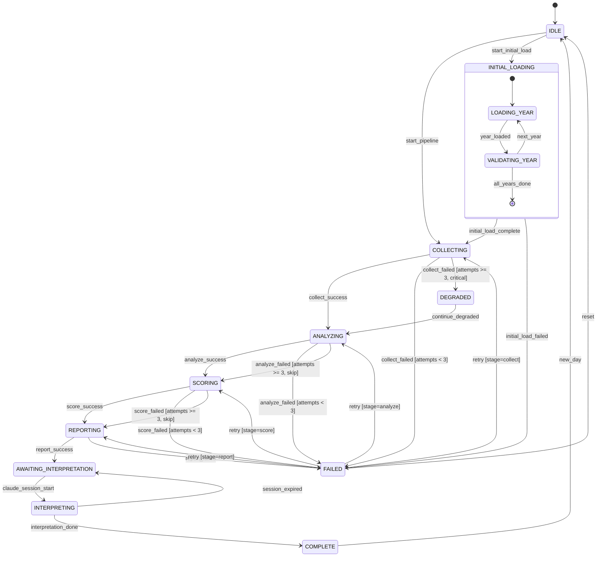

# Branch 5: State Management & Recovery — Comparative Analysis

> **System**: KOSPI/KOSDAQ Stock Technical Completeness Analysis & Selection System
> **Architecture**: launchd -> Python Pipeline (collect -> analyze -> score -> report) -> Claude Code interpretation
> **Persistent Store**: DuckDB (ohlcv, indicators, scores tables)
> **Date**: 2026-05-26

---

## Branch 5.1: File-Based State Management

### 1. State File Schema Design

#### 1.1 Pipeline State File (`pipeline_state.json`)

**JSON Schema**:

```json
{
  "$schema": "http://json-schema.org/draft-07/schema#",
  "type": "object",
  "required": ["run_id", "stage", "status", "created_at", "updated_at"],
  "properties": {
    "run_id": {
      "type": "string",
      "pattern": "^\\d{4}-\\d{2}-\\d{2}$",
      "description": "Date-based run identifier (e.g., 2026-05-26)"
    },
    "stage": {
      "type": "string",
      "enum": ["collect", "analyze", "score", "report", "interpret", "complete"]
    },
    "status": {
      "type": "string",
      "enum": ["running", "success", "failed", "degraded"]
    },
    "last_successful_stage": {
      "type": ["string", "null"],
      "enum": ["collect", "analyze", "score", "report", "interpret", "complete", null]
    },
    "last_successful_at": {
      "type": ["string", "null"],
      "format": "date-time"
    },
    "created_at": {
      "type": "string",
      "format": "date-time"
    },
    "updated_at": {
      "type": "string",
      "format": "date-time"
    },
    "attempt": {
      "type": "integer",
      "minimum": 1,
      "maximum": 3,
      "default": 1
    },
    "error": {
      "type": ["object", "null"],
      "properties": {
        "stage": { "type": "string" },
        "message": { "type": "string" },
        "traceback": { "type": "string" },
        "timestamp": { "type": "string", "format": "date-time" }
      }
    },
    "lock_pid": {
      "type": ["integer", "null"],
      "description": "PID of the process holding the pipeline lock"
    },
    "lock_acquired_at": {
      "type": ["string", "null"],
      "format": "date-time"
    }
  }
}
```

**Concrete Example** (normal daily run, mid-pipeline):

```json
{
  "run_id": "2026-05-26",
  "stage": "analyze",
  "status": "running",
  "last_successful_stage": "collect",
  "last_successful_at": "2026-05-26T18:03:42+09:00",
  "created_at": "2026-05-26T18:00:01+09:00",
  "updated_at": "2026-05-26T18:03:42+09:00",
  "attempt": 1,
  "error": null,
  "lock_pid": 54321,
  "lock_acquired_at": "2026-05-26T18:00:01+09:00"
}
```

**Concrete Example** (failed state after analyze crash):

```json
{
  "run_id": "2026-05-26",
  "stage": "analyze",
  "status": "failed",
  "last_successful_stage": "collect",
  "last_successful_at": "2026-05-26T18:03:42+09:00",
  "created_at": "2026-05-26T18:00:01+09:00",
  "updated_at": "2026-05-26T18:05:18+09:00",
  "attempt": 2,
  "error": {
    "stage": "analyze",
    "message": "pandas-ta: KeyError 'close' — missing column in OHLCV data for ticker 005930",
    "traceback": "Traceback (most recent call last):\n  File \"analyze.py\", line 142...",
    "timestamp": "2026-05-26T18:05:18+09:00"
  },
  "lock_pid": null,
  "lock_acquired_at": null
}
```

[LOCAL-OK] — JSON files, no external services.

---

#### 1.2 Task Result Files (Per-Stage Output Metadata)

**Schema** (`collect_result.json` example):

```json
{
  "stage": "collect",
  "run_id": "2026-05-26",
  "started_at": "2026-05-26T18:00:02+09:00",
  "completed_at": "2026-05-26T18:03:42+09:00",
  "duration_seconds": 220,
  "input": {
    "date_range": "2026-05-26",
    "markets": ["KOSPI", "KOSDAQ"],
    "mode": "incremental"
  },
  "output": {
    "duckdb_table": "ohlcv",
    "rows_inserted": 2487,
    "rows_updated": 0,
    "date_coverage": "2026-05-26",
    "tickers_processed": 2487,
    "tickers_failed": 3,
    "failed_tickers": ["900110", "900120", "900130"]
  },
  "checksum": {
    "algorithm": "xxhash64",
    "value": "a1b2c3d4e5f67890",
    "scope": "SELECT COUNT(*), SUM(close) FROM ohlcv WHERE date='2026-05-26'"
  },
  "duckdb_path": "data/stock_analysis.duckdb"
}
```

**Naming Convention**: `{stage}_result.json` in `state/runs/{run_id}/`

**Why xxhash64**: Fast (10GB/s), built into DuckDB (`SELECT xxhash64(...)`) — no external dependency. Validates data integrity between stages. [LOCAL-OK]

---

#### 1.3 Checkpoint Files (Long-Running Initial Load)

**Schema** (`initial_load_checkpoint.json`):

```json
{
  "$schema": "http://json-schema.org/draft-07/schema#",
  "type": "object",
  "required": ["task", "status", "progress"],
  "properties": {
    "task": {
      "type": "string",
      "const": "initial_5year_load"
    },
    "status": {
      "type": "string",
      "enum": ["in_progress", "completed", "failed"]
    },
    "progress": {
      "type": "object",
      "properties": {
        "total_years": { "type": "integer" },
        "completed_years": {
          "type": "array",
          "items": { "type": "integer" },
          "description": "Years fully loaded into DuckDB"
        },
        "current_year": { "type": ["integer", "null"] },
        "current_year_last_date": {
          "type": ["string", "null"],
          "description": "Last successfully loaded date within current_year"
        },
        "rows_loaded_total": { "type": "integer" },
        "estimated_remaining_minutes": { "type": ["number", "null"] }
      }
    },
    "started_at": { "type": "string", "format": "date-time" },
    "updated_at": { "type": "string", "format": "date-time" },
    "error": {
      "type": ["object", "null"],
      "properties": {
        "message": { "type": "string" },
        "year": { "type": "integer" },
        "date": { "type": "string" }
      }
    }
  }
}
```

**Concrete Example** (interrupted at year 3):

```json
{
  "task": "initial_5year_load",
  "status": "in_progress",
  "progress": {
    "total_years": 5,
    "completed_years": [2021, 2022],
    "current_year": 2023,
    "current_year_last_date": "2023-07-14",
    "rows_loaded_total": 1243000,
    "estimated_remaining_minutes": 42
  },
  "started_at": "2026-05-26T14:00:00+09:00",
  "updated_at": "2026-05-26T14:48:23+09:00",
  "error": null
}
```

**Resume logic**: On restart, read checkpoint -> skip completed_years -> start from `current_year_last_date + 1 day`. DuckDB UPSERT ensures idempotency if a date was partially loaded. [LOCAL-OK]

---

### 2. Inter-Agent State Passing

#### 2.1 Complete File Layout

```
project_root/
├── state/
│   ├── pipeline_state.json          ← Master pipeline state (Orchestrator R/W)
│   ├── pipeline.lock                ← Lock file (flock-based)
│   ├── runs/
│   │   ├── 2026-05-26/
│   │   │   ├── collect_result.json  ← Stage output metadata
│   │   │   ├── analyze_result.json
│   │   │   ├── score_result.json
│   │   │   └── report_result.json
│   │   ├── 2026-05-25/
│   │   │   └── ...
│   │   └── ...  (last 30 days retained)
│   └── checkpoints/
│       └── initial_load_checkpoint.json
├── data/
│   └── stock_analysis.duckdb        ← Persistent data store
├── output/
│   ├── 2026-05-26/
│   │   └── summary.md               ← Generated report
│   └── ...
└── logs/
    ├── pipeline_2026-05-26.log      ← Full pipeline log
    └── ...  (last 14 days retained)
```

#### 2.2 Access Patterns

| Actor | Reads | Writes |
|-------|-------|--------|
| **Orchestrator** (pipeline runner) | `pipeline_state.json`, all `*_result.json` | `pipeline_state.json`, `pipeline.lock` |
| **collect.py** (sub-agent) | checkpoint (if initial load) | `collect_result.json`, checkpoint |
| **analyze.py** (sub-agent) | `collect_result.json` (validates precondition) | `analyze_result.json` |
| **score.py** (sub-agent) | `analyze_result.json` (validates precondition) | `score_result.json` |
| **report.py** (sub-agent) | `score_result.json` (validates precondition) | `report_result.json`, `summary.md` |
| **Claude Code SessionStart hook** | `pipeline_state.json` (read-only) | none |
| **launchd** | none | triggers orchestrator |
| **User /scan command** | `pipeline_state.json` (check if running) | may trigger orchestrator |

**Key constraint**: Only the orchestrator writes `pipeline_state.json`. Sub-agents write only their own `*_result.json`. This matches the existing SOT pattern (Absolute Standard 2): single writer for shared state.

#### 2.3 Sub-Agent Precondition Checking

Each sub-agent verifies its precondition by reading the previous stage's result file:

```python
# analyze.py — precondition check
def check_precondition(run_dir: str) -> bool:
    """Verify collect stage completed successfully before analyzing."""
    collect_result_path = os.path.join(run_dir, "collect_result.json")
    if not os.path.exists(collect_result_path):
        raise PreconditionError("collect_result.json not found — collect stage did not complete")
    
    with open(collect_result_path, "r") as f:
        result = json.load(f)
    
    if result.get("output", {}).get("rows_inserted", 0) == 0:
        raise PreconditionError("collect inserted 0 rows — nothing to analyze")
    
    return True
```

[LOCAL-OK] — File reads only, no IPC.

---

### 3. Error Recovery Implementation

#### 3.1 Core Resume Logic

```python
#!/usr/bin/env python3
"""
Pipeline Resume Logic — Determines next action based on pipeline_state.json.

Used by:
  1. Orchestrator (pipeline_runner.py) — on startup, resume from last state
  2. SessionStart hook — inject pipeline status into Claude Code context
  3. /scan command — check if pipeline needs attention

Design:
  - Pure function: reads state file, returns decision
  - No side effects: does not modify state
  - Idempotent: safe to call multiple times
"""

import json
import os
from datetime import datetime, date
from typing import Optional, Tuple
from dataclasses import dataclass
from enum import Enum


class Action(Enum):
    """Pipeline resume actions."""
    RUN_FULL = "run_full"           # No state or stale — start fresh
    RESUME_STAGE = "resume_stage"    # Failed/interrupted — resume from stage
    SKIP_COMPLETE = "skip_complete"  # Today's run already complete
    WAIT_RUNNING = "wait_running"    # Another process is running
    RESUME_INITIAL_LOAD = "resume_initial_load"  # 5-year load interrupted


@dataclass
class ResumeDecision:
    """What the pipeline should do next."""
    action: Action
    stage: Optional[str]         # Which stage to run (for RESUME_STAGE)
    reason: str                  # Human-readable explanation
    run_id: str                  # Date-based run ID
    attempt: int                 # Retry attempt number


# Stage execution order — linear pipeline
STAGE_ORDER = ["collect", "analyze", "score", "report"]

# Stage after each stage (for determining next stage)
NEXT_STAGE = {
    "collect": "analyze",
    "analyze": "score",
    "score": "report",
    "report": None,  # Pipeline complete after report
}

MAX_RETRIES = 3
STALE_LOCK_SECONDS = 3600  # 1 hour — assume crashed if lock held this long


def resume_pipeline(state_dir: str) -> ResumeDecision:
    """
    Determine what the pipeline should do next.
    
    Args:
        state_dir: Path to state/ directory
    
    Returns:
        ResumeDecision with action, target stage, and reason
    
    This function is pure: it reads files but never writes.
    """
    today = date.today().isoformat()  # "2026-05-26"
    state_path = os.path.join(state_dir, "pipeline_state.json")
    
    # --- Check for interrupted initial 5-year load ---
    checkpoint_path = os.path.join(state_dir, "checkpoints", "initial_load_checkpoint.json")
    if os.path.exists(checkpoint_path):
        with open(checkpoint_path, "r") as f:
            checkpoint = json.load(f)
        if checkpoint.get("status") == "in_progress":
            return ResumeDecision(
                action=Action.RESUME_INITIAL_LOAD,
                stage="collect",
                reason=f"Initial 5-year load interrupted. "
                       f"Completed years: {checkpoint['progress']['completed_years']}. "
                       f"Resume from {checkpoint['progress'].get('current_year_last_date', 'beginning')}.",
                run_id="initial_load",
                attempt=1,
            )
    
    # --- No state file — first run of the day ---
    if not os.path.exists(state_path):
        return ResumeDecision(
            action=Action.RUN_FULL,
            stage="collect",
            reason="No pipeline state found — starting fresh daily run.",
            run_id=today,
            attempt=1,
        )
    
    # --- Read current state ---
    with open(state_path, "r") as f:
        state = json.load(f)
    
    run_id = state.get("run_id", "")
    status = state.get("status", "")
    stage = state.get("stage", "")
    attempt = state.get("attempt", 1)
    
    # --- Different day — start fresh ---
    if run_id != today:
        return ResumeDecision(
            action=Action.RUN_FULL,
            stage="collect",
            reason=f"State is from {run_id}, today is {today} — starting fresh.",
            run_id=today,
            attempt=1,
        )
    
    # --- Already complete ---
    if status == "success" and stage == "report":
        return ResumeDecision(
            action=Action.SKIP_COMPLETE,
            stage=None,
            reason=f"Today's pipeline ({run_id}) already completed successfully.",
            run_id=run_id,
            attempt=attempt,
        )
    
    # --- Currently running — check for stale lock ---
    if status == "running":
        lock_pid = state.get("lock_pid")
        lock_time = state.get("lock_acquired_at", "")
        
        # Check if PID is still alive
        if lock_pid and _is_process_alive(lock_pid):
            # Check for stale lock (process alive but possibly hung)
            if lock_time:
                lock_age = (datetime.now() - datetime.fromisoformat(lock_time)).total_seconds()
                if lock_age > STALE_LOCK_SECONDS:
                    return ResumeDecision(
                        action=Action.RESUME_STAGE,
                        stage=stage,
                        reason=f"Lock held by PID {lock_pid} for {lock_age:.0f}s (>{STALE_LOCK_SECONDS}s) — "
                               f"assuming hung. Resuming from {stage}.",
                        run_id=run_id,
                        attempt=attempt,
                    )
            return ResumeDecision(
                action=Action.WAIT_RUNNING,
                stage=stage,
                reason=f"Pipeline is running (PID {lock_pid}, stage: {stage}). Wait or check logs.",
                run_id=run_id,
                attempt=attempt,
            )
        else:
            # PID dead — process crashed without updating state
            return ResumeDecision(
                action=Action.RESUME_STAGE,
                stage=stage,
                reason=f"Pipeline crashed (PID {lock_pid} no longer alive) during {stage}. "
                       f"Resuming from {stage}.",
                run_id=run_id,
                attempt=attempt,
            )
    
    # --- Failed — retry or advance ---
    if status == "failed":
        if attempt >= MAX_RETRIES:
            # Max retries exhausted — try graceful degradation
            next_stage = NEXT_STAGE.get(stage)
            if next_stage and stage != "collect":
                # Can't skip collect, but can skip analyze/score with degraded results
                return ResumeDecision(
                    action=Action.RESUME_STAGE,
                    stage=next_stage,
                    reason=f"Stage '{stage}' failed {attempt} times. "
                           f"Skipping to '{next_stage}' with degraded data.",
                    run_id=run_id,
                    attempt=1,  # Reset attempt for next stage
                )
            else:
                return ResumeDecision(
                    action=Action.RUN_FULL,
                    stage="collect",
                    reason=f"Stage '{stage}' failed {attempt} times and cannot be skipped. "
                           f"Full restart required.",
                    run_id=run_id,
                    attempt=1,
                )
        else:
            return ResumeDecision(
                action=Action.RESUME_STAGE,
                stage=stage,
                reason=f"Stage '{stage}' failed (attempt {attempt}/{MAX_RETRIES}). "
                       f"Retrying.",
                run_id=run_id,
                attempt=attempt + 1,
            )
    
    # --- Success — advance to next stage ---
    if status == "success":
        next_stage = NEXT_STAGE.get(stage)
        if next_stage:
            return ResumeDecision(
                action=Action.RESUME_STAGE,
                stage=next_stage,
                reason=f"Stage '{stage}' succeeded. Advancing to '{next_stage}'.",
                run_id=run_id,
                attempt=1,
            )
        else:
            return ResumeDecision(
                action=Action.SKIP_COMPLETE,
                stage=None,
                reason=f"All stages complete for {run_id}.",
                run_id=run_id,
                attempt=attempt,
            )
    
    # --- Unknown status — defensive fallback ---
    return ResumeDecision(
        action=Action.RUN_FULL,
        stage="collect",
        reason=f"Unrecognized state (status={status}, stage={stage}). Starting fresh.",
        run_id=today,
        attempt=1,
    )


def _is_process_alive(pid: int) -> bool:
    """Check if a process with given PID is still running (macOS/POSIX)."""
    try:
        os.kill(pid, 0)  # Signal 0 — doesn't kill, just checks existence
        return True
    except (OSError, ProcessLookupError):
        return False
```

[LOCAL-OK] — `os.kill(pid, 0)` is POSIX-standard, works on macOS.

#### 3.2 SessionStart Hook Integration

```python
#!/usr/bin/env python3
"""
Pipeline State Injection — SessionStart Hook Extension

Integrates with existing restore_context.py by reading pipeline_state.json
and injecting pipeline status into Claude Code's recovery context.

This is NOT a standalone hook — it's called by restore_context.py
(or a small wrapper) to add pipeline-specific context alongside
the existing context preservation output.

Design:
  - Read-only: never modifies pipeline_state.json
  - Non-blocking: returns empty string on any error
  - Follows existing RLM pattern: outputs pointer + summary
"""

import json
import os
from datetime import datetime


def get_pipeline_context(project_dir: str) -> str:
    """
    Generate pipeline status context for SessionStart injection.
    
    Returns a formatted string to append to [CONTEXT RECOVERY] output.
    Returns empty string if no pipeline state exists or on error.
    """
    state_dir = os.path.join(project_dir, "state")
    state_path = os.path.join(state_dir, "pipeline_state.json")
    
    if not os.path.exists(state_path):
        return ""
    
    try:
        with open(state_path, "r") as f:
            state = json.load(f)
    except (json.JSONDecodeError, OSError):
        return ""
    
    run_id = state.get("run_id", "?")
    stage = state.get("stage", "?")
    status = state.get("status", "?")
    last_ok = state.get("last_successful_stage", "none")
    error = state.get("error")
    attempt = state.get("attempt", 1)
    
    lines = [
        "",
        "━━━ PIPELINE STATUS ━━━",
        f"Run: {run_id} | Stage: {stage} | Status: {status}",
        f"Last successful stage: {last_ok}",
    ]
    
    if status == "failed" and error:
        lines.append(f"Error (attempt {attempt}/3): {error.get('message', 'unknown')}")
        lines.append(f"  at stage: {error.get('stage', '?')}")
        lines.append(f"  time: {error.get('timestamp', '?')}")
    
    if status == "running":
        lock_pid = state.get("lock_pid")
        lines.append(f"Currently running (PID: {lock_pid})")
        lines.append("Do NOT start another pipeline run.")
    
    if status == "failed":
        lines.append("")
        lines.append("Recovery action: Run pipeline to resume from failed stage.")
        lines.append(f"  Command: python3 pipeline_runner.py --resume")
    
    # Check for interrupted initial load
    checkpoint_path = os.path.join(state_dir, "checkpoints", "initial_load_checkpoint.json")
    if os.path.exists(checkpoint_path):
        try:
            with open(checkpoint_path, "r") as f:
                cp = json.load(f)
            if cp.get("status") == "in_progress":
                progress = cp.get("progress", {})
                completed = progress.get("completed_years", [])
                total = progress.get("total_years", 5)
                lines.append("")
                lines.append(f"INITIAL LOAD IN PROGRESS: {len(completed)}/{total} years complete")
                lines.append(f"  Resume: python3 pipeline_runner.py --resume-initial-load")
        except (json.JSONDecodeError, OSError):
            pass
    
    return "\n".join(lines)
```

[LOCAL-OK] — Pure file reads.

#### 3.3 Orchestrator State Update Logic

```python
#!/usr/bin/env python3
"""
Pipeline Orchestrator — State Update Functions

Manages pipeline_state.json transitions during pipeline execution.
Single writer: only the orchestrator calls these functions.

Design:
  - Atomic writes: temp file -> rename (matches _context_lib.py pattern)
  - Lock acquisition before any state change
  - Every state change is logged to pipeline log
"""

import json
import os
import fcntl
import tempfile
import logging
from datetime import datetime
from typing import Optional


logger = logging.getLogger("pipeline")


def _atomic_write_json(filepath: str, data: dict) -> None:
    """Write JSON atomically: temp file -> rename."""
    dirpath = os.path.dirname(filepath)
    os.makedirs(dirpath, exist_ok=True)
    
    fd, tmp_path = tempfile.mkstemp(dir=dirpath, suffix=".tmp")
    try:
        with os.fdopen(fd, "w", encoding="utf-8") as f:
            json.dump(data, f, indent=2, ensure_ascii=False, default=str)
            f.write("\n")
        os.rename(tmp_path, filepath)
    except Exception:
        try:
            os.unlink(tmp_path)
        except OSError:
            pass
        raise


def update_pipeline_state(
    state_dir: str,
    stage: str,
    status: str,
    error: Optional[dict] = None,
    attempt: int = 1,
) -> dict:
    """
    Update pipeline_state.json atomically.
    
    Called by the orchestrator at:
      - Stage start: update_pipeline_state(dir, "collect", "running")
      - Stage success: update_pipeline_state(dir, "collect", "success")
      - Stage failure: update_pipeline_state(dir, "collect", "failed", error={...})
    """
    state_path = os.path.join(state_dir, "pipeline_state.json")
    now = datetime.now().astimezone().isoformat()
    
    # Read existing state (if any)
    existing = {}
    if os.path.exists(state_path):
        try:
            with open(state_path, "r") as f:
                existing = json.load(f)
        except (json.JSONDecodeError, OSError):
            pass
    
    # Build updated state
    from datetime import date
    run_id = existing.get("run_id", date.today().isoformat())
    
    state = {
        "run_id": run_id,
        "stage": stage,
        "status": status,
        "last_successful_stage": existing.get("last_successful_stage"),
        "last_successful_at": existing.get("last_successful_at"),
        "created_at": existing.get("created_at", now),
        "updated_at": now,
        "attempt": attempt,
        "error": error,
        "lock_pid": os.getpid() if status == "running" else None,
        "lock_acquired_at": now if status == "running" else None,
    }
    
    # Update last_successful on success
    if status == "success":
        state["last_successful_stage"] = stage
        state["last_successful_at"] = now
    
    _atomic_write_json(state_path, state)
    logger.info(f"State updated: stage={stage} status={status} attempt={attempt}")
    
    return state


def write_stage_result(
    state_dir: str,
    run_id: str,
    stage: str,
    result: dict,
) -> str:
    """
    Write per-stage result file atomically.
    
    Returns the path to the written result file.
    """
    run_dir = os.path.join(state_dir, "runs", run_id)
    result_path = os.path.join(run_dir, f"{stage}_result.json")
    
    _atomic_write_json(result_path, result)
    logger.info(f"Stage result written: {result_path}")
    
    return result_path


def update_checkpoint(
    state_dir: str,
    checkpoint_name: str,
    data: dict,
) -> str:
    """
    Update a checkpoint file atomically.
    
    Used for long-running operations like the initial 5-year load.
    """
    cp_dir = os.path.join(state_dir, "checkpoints")
    cp_path = os.path.join(cp_dir, f"{checkpoint_name}.json")
    
    data["updated_at"] = datetime.now().astimezone().isoformat()
    _atomic_write_json(cp_path, data)
    logger.info(f"Checkpoint updated: {cp_path}")
    
    return cp_path
```

[LOCAL-OK]

---

### 4. Race Condition Handling

#### 4.1 Lock File Implementation

```python
#!/usr/bin/env python3
"""
Pipeline Lock Manager — Prevents concurrent pipeline execution.

Uses fcntl.flock() for advisory file locking (POSIX).
Same pattern as _context_lib.py append_with_lock().

Scenarios handled:
  1. launchd fires while previous run is active -> LOCK_NB fails -> skip
  2. User runs /scan while pipeline running -> lock check -> "running" message
  3. Process crashes without releasing lock -> flock auto-releases on process exit
  4. Mac sleeps mid-pipeline -> on wake, PID check detects dead process

Design decisions:
  - Advisory locking (not mandatory) — sufficient for single-user macOS
  - fcntl.flock() — auto-releases when process dies (unlike lockfile deletion)
  - Stale lock detection via PID check + age threshold (1 hour)
"""

import fcntl
import os
import json
import time
from datetime import datetime
from typing import Optional


class PipelineLock:
    """
    Context manager for pipeline execution lock.
    
    Usage:
        with PipelineLock(state_dir) as lock:
            if lock.acquired:
                run_pipeline()
            else:
                print(f"Pipeline already running: {lock.reason}")
    """
    
    LOCK_FILENAME = "pipeline.lock"
    STALE_THRESHOLD_SECONDS = 3600  # 1 hour
    
    def __init__(self, state_dir: str):
        self.state_dir = state_dir
        self.lock_path = os.path.join(state_dir, self.LOCK_FILENAME)
        self.lock_fd: Optional[int] = None
        self.acquired = False
        self.reason = ""
    
    def __enter__(self):
        os.makedirs(self.state_dir, exist_ok=True)
        
        # Open (or create) the lock file
        self.lock_fd = os.open(
            self.lock_path,
            os.O_RDWR | os.O_CREAT,
            0o644,
        )
        
        try:
            # Non-blocking exclusive lock
            fcntl.flock(self.lock_fd, fcntl.LOCK_EX | fcntl.LOCK_NB)
            self.acquired = True
            
            # Write our PID + timestamp into the lock file
            lock_info = json.dumps({
                "pid": os.getpid(),
                "acquired_at": datetime.now().astimezone().isoformat(),
            })
            os.ftruncate(self.lock_fd, 0)
            os.lseek(self.lock_fd, 0, os.SEEK_SET)
            os.write(self.lock_fd, lock_info.encode("utf-8"))
            
        except BlockingIOError:
            # Lock is held by another process
            self.acquired = False
            self.reason = self._diagnose_lock_holder()
        
        return self
    
    def __exit__(self, exc_type, exc_val, exc_tb):
        if self.lock_fd is not None:
            if self.acquired:
                fcntl.flock(self.lock_fd, fcntl.LOCK_UN)
            os.close(self.lock_fd)
            self.lock_fd = None
            self.acquired = False
        return False  # Don't suppress exceptions
    
    def _diagnose_lock_holder(self) -> str:
        """Read the lock file to identify who holds the lock."""
        try:
            os.lseek(self.lock_fd, 0, os.SEEK_SET)
            content = os.read(self.lock_fd, 4096).decode("utf-8")
            info = json.loads(content)
            pid = info.get("pid", "?")
            acquired = info.get("acquired_at", "?")
            
            # Check if the holding process is still alive
            if isinstance(pid, int):
                try:
                    os.kill(pid, 0)
                    return f"Pipeline running (PID {pid}, since {acquired})"
                except (OSError, ProcessLookupError):
                    return f"Stale lock from dead process (PID {pid}). Safe to force-clear."
            
            return f"Lock held by PID {pid} since {acquired}"
        except Exception:
            return "Lock held by unknown process"
    
    def force_release(self) -> bool:
        """
        Force-release a stale lock. Only call after confirming holder is dead.
        
        Returns True if lock was successfully cleared.
        """
        try:
            if os.path.exists(self.lock_path):
                os.unlink(self.lock_path)
            return True
        except OSError:
            return False
```

#### 4.2 Integration with Pipeline Runner

```python
def run_daily_pipeline(project_dir: str):
    """Main entry point — called by launchd or manually."""
    state_dir = os.path.join(project_dir, "state")
    
    with PipelineLock(state_dir) as lock:
        if not lock.acquired:
            logger.warning(f"Skipping: {lock.reason}")
            return  # launchd exits cleanly — will try again tomorrow
        
        decision = resume_pipeline(state_dir)
        
        if decision.action == Action.SKIP_COMPLETE:
            logger.info(decision.reason)
            return
        
        if decision.action == Action.WAIT_RUNNING:
            logger.warning(decision.reason)
            return
        
        if decision.action == Action.RESUME_INITIAL_LOAD:
            _run_initial_load(project_dir, state_dir)
            return
        
        # RUN_FULL or RESUME_STAGE
        start_stage = decision.stage
        attempt = decision.attempt
        
        # Execute stages sequentially from start_stage
        stage_idx = STAGE_ORDER.index(start_stage)
        for stage_name in STAGE_ORDER[stage_idx:]:
            try:
                update_pipeline_state(state_dir, stage_name, "running", attempt=attempt)
                
                result = _execute_stage(project_dir, stage_name, decision.run_id)
                
                write_stage_result(state_dir, decision.run_id, stage_name, result)
                update_pipeline_state(state_dir, stage_name, "success", attempt=attempt)
                
                attempt = 1  # Reset attempt counter for next stage
                
            except Exception as e:
                error_info = {
                    "stage": stage_name,
                    "message": str(e),
                    "traceback": traceback.format_exc(),
                    "timestamp": datetime.now().astimezone().isoformat(),
                }
                update_pipeline_state(
                    state_dir, stage_name, "failed",
                    error=error_info, attempt=attempt,
                )
                logger.error(f"Stage {stage_name} failed: {e}")
                
                # Retry logic — re-run from this stage on next invocation
                break  # Exit the stage loop; next launchd/manual run will resume


def _execute_stage(project_dir: str, stage: str, run_id: str) -> dict:
    """
    Execute a single pipeline stage. Returns result metadata dict.
    
    Each stage function must:
      1. Read input from DuckDB (or previous stage result)
      2. Process data
      3. Write output to DuckDB (UPSERT for idempotency)
      4. Return metadata dict
    """
    import importlib
    
    # Dynamic stage dispatch — each stage is a Python module
    module = importlib.import_module(f"stages.{stage}")
    return module.run(project_dir=project_dir, run_id=run_id)
```

[LOCAL-OK] — `fcntl.flock()` is macOS native.

---

### 5. Complexity Analysis (Branch 5.1)

| Dimension | Rating | Justification |
|-----------|--------|---------------|
| **Implementation effort** | **LOW** | JSON read/write, no dependencies beyond stdlib. ~400 lines total. |
| **Debugging ease** | **HIGH** | `cat pipeline_state.json` instantly shows current state. Human-readable. |
| **Concurrent access safety** | **MED** | `fcntl.flock()` handles process-level races. No thread-level or distributed concerns (single macOS machine). Advisory locking is sufficient. |
| **Recovery reliability** | **MED** | Relies on convention (each stage checks previous result file). No enforcement of valid transitions — a bug could skip stages. |
| **Maintenance burden** | **LOW** | Files are self-documenting. No schema migration needed — just add fields. |

---

## Branch 5.2: Structured State Machine

### 1. State Machine Design

#### 1.1 State Transition Diagram (Mermaid)



#### 1.2 Transition Rules

| From State | To State | Guard Condition | Side Effect |
|-----------|----------|-----------------|-------------|
| IDLE | COLLECTING | `is_trading_day(today)` AND `not already_complete(today)` | Create run record |
| COLLECTING | ANALYZING | `ohlcv_row_count > 0` AND `collect_result.checksum valid` | Log transition |
| ANALYZING | SCORING | `indicators_table populated` | Log transition |
| SCORING | REPORTING | `scores_table populated` | Log transition |
| REPORTING | AWAITING_INTERPRETATION | `summary.md exists` AND `len > 0` | Log transition |
| AWAITING_INTERPRETATION | INTERPRETING | Claude Code session active | Log transition |
| INTERPRETING | COMPLETE | Interpretation saved | Archive run |
| ANY → FAILED | Valid source states only | `exception raised` | Record error |
| FAILED | Retry target | `attempts < max_retries` | Increment attempt |

#### 1.3 Forbidden Transitions

```python
# Transitions that MUST NOT happen — enforced by the state machine
FORBIDDEN_TRANSITIONS = {
    ("IDLE", "ANALYZING"),       # Can't analyze without collecting
    ("IDLE", "SCORING"),         # Can't score without analyzing
    ("IDLE", "REPORTING"),       # Can't report without scoring
    ("IDLE", "INTERPRETING"),    # Can't interpret without reporting
    ("IDLE", "COMPLETE"),        # Can't complete without going through pipeline
    ("COLLECTING", "SCORING"),   # Can't skip analyze
    ("COLLECTING", "REPORTING"), # Can't skip analyze+score
    ("ANALYZING", "REPORTING"),  # Can't skip score
    ("COMPLETE", "COLLECTING"),  # Must go through IDLE first (new day)
    ("COMPLETE", "FAILED"),      # Already complete — can't fail retroactively
}
```

#### 1.4 State Machine JSON Schema

```json
{
  "$schema": "http://json-schema.org/draft-07/schema#",
  "type": "object",
  "required": ["state", "run_id", "transitions", "metadata"],
  "properties": {
    "state": {
      "type": "string",
      "enum": [
        "IDLE", "COLLECTING", "ANALYZING", "SCORING",
        "REPORTING", "AWAITING_INTERPRETATION", "INTERPRETING",
        "COMPLETE", "FAILED", "DEGRADED", "INITIAL_LOADING"
      ]
    },
    "previous_state": { "type": ["string", "null"] },
    "run_id": { "type": "string" },
    "sub_state": {
      "type": ["object", "null"],
      "description": "Sub-state machine (e.g., for INITIAL_LOADING)",
      "properties": {
        "state": { "type": "string" },
        "context": { "type": "object" }
      }
    },
    "failed_stage": {
      "type": ["string", "null"],
      "description": "Which stage caused FAILED state"
    },
    "attempt_counts": {
      "type": "object",
      "description": "Per-stage retry counts",
      "additionalProperties": { "type": "integer" }
    },
    "transitions": {
      "type": "array",
      "description": "Transition audit log (last N entries)",
      "items": {
        "type": "object",
        "properties": {
          "from": { "type": "string" },
          "to": { "type": "string" },
          "trigger": { "type": "string" },
          "timestamp": { "type": "string", "format": "date-time" },
          "context": { "type": "object" }
        }
      }
    },
    "metadata": {
      "type": "object",
      "properties": {
        "created_at": { "type": "string", "format": "date-time" },
        "updated_at": { "type": "string", "format": "date-time" },
        "lock_pid": { "type": ["integer", "null"] },
        "degraded_stages": {
          "type": "array",
          "items": { "type": "string" },
          "description": "Stages that were skipped due to repeated failure"
        }
      }
    }
  }
}
```

**Concrete Example** (analyze failed, retry pending):

```json
{
  "state": "FAILED",
  "previous_state": "ANALYZING",
  "run_id": "2026-05-26",
  "sub_state": null,
  "failed_stage": "analyze",
  "attempt_counts": {
    "collect": 1,
    "analyze": 2
  },
  "transitions": [
    {
      "from": "IDLE",
      "to": "COLLECTING",
      "trigger": "start_pipeline",
      "timestamp": "2026-05-26T18:00:01+09:00",
      "context": {"mode": "incremental"}
    },
    {
      "from": "COLLECTING",
      "to": "ANALYZING",
      "trigger": "collect_success",
      "timestamp": "2026-05-26T18:03:42+09:00",
      "context": {"rows": 2487}
    },
    {
      "from": "ANALYZING",
      "to": "FAILED",
      "trigger": "analyze_failed",
      "timestamp": "2026-05-26T18:05:18+09:00",
      "context": {"error": "KeyError 'close'", "attempt": 2}
    }
  ],
  "metadata": {
    "created_at": "2026-05-26T18:00:01+09:00",
    "updated_at": "2026-05-26T18:05:18+09:00",
    "lock_pid": null,
    "degraded_stages": []
  }
}
```

---

### 2. Implementation: `PipelineStateMachine` Class

```python
#!/usr/bin/env python3
"""
Pipeline State Machine — Enforced state transitions with invariant checking.

Formal state machine that:
  1. Defines all valid states and transitions
  2. Enforces guard conditions on every transition
  3. Logs every transition with context (audit trail)
  4. Prevents invalid state sequences
  5. Supports sub-state machines (initial load)
  6. Provides rollback capability

Design:
  - State machine definition is data (TRANSITIONS dict), not code
  - Transition enforcement is a single function (transition())
  - State persisted as JSON (same atomic write pattern as Branch 5.1)
  - Sub-state machines are nested PipelineStateMachine instances
"""

import json
import os
import tempfile
from datetime import datetime, date
from typing import Optional, Dict, Any, Tuple, List, Callable
from dataclasses import dataclass, field
from enum import Enum
import logging

logger = logging.getLogger("pipeline.fsm")


class State(str, Enum):
    """Pipeline states."""
    IDLE = "IDLE"
    COLLECTING = "COLLECTING"
    ANALYZING = "ANALYZING"
    SCORING = "SCORING"
    REPORTING = "REPORTING"
    AWAITING_INTERPRETATION = "AWAITING_INTERPRETATION"
    INTERPRETING = "INTERPRETING"
    COMPLETE = "COMPLETE"
    FAILED = "FAILED"
    DEGRADED = "DEGRADED"
    INITIAL_LOADING = "INITIAL_LOADING"


class Trigger(str, Enum):
    """Events that cause state transitions."""
    START_PIPELINE = "start_pipeline"
    START_INITIAL_LOAD = "start_initial_load"
    COLLECT_SUCCESS = "collect_success"
    COLLECT_FAILED = "collect_failed"
    ANALYZE_SUCCESS = "analyze_success"
    ANALYZE_FAILED = "analyze_failed"
    SCORE_SUCCESS = "score_success"
    SCORE_FAILED = "score_failed"
    REPORT_SUCCESS = "report_success"
    REPORT_FAILED = "report_failed"
    CLAUDE_SESSION_START = "claude_session_start"
    INTERPRETATION_DONE = "interpretation_done"
    SESSION_EXPIRED = "session_expired"
    INITIAL_LOAD_COMPLETE = "initial_load_complete"
    INITIAL_LOAD_FAILED = "initial_load_failed"
    RETRY = "retry"
    SKIP_DEGRADED = "skip_degraded"
    RESET = "reset"
    NEW_DAY = "new_day"


@dataclass
class TransitionRule:
    """Defines a valid state transition."""
    from_state: State
    to_state: State
    trigger: Trigger
    guard: Optional[Callable[[Dict[str, Any]], bool]] = None
    description: str = ""


@dataclass
class TransitionRecord:
    """Audit log entry for a state transition."""
    from_state: str
    to_state: str
    trigger: str
    timestamp: str
    context: Dict[str, Any] = field(default_factory=dict)


class InvalidTransitionError(Exception):
    """Raised when an invalid state transition is attempted."""
    pass


class GuardFailedError(Exception):
    """Raised when a transition guard condition is not met."""
    pass


# ============================================================================
# Transition Definition Table
# ============================================================================

def _guard_has_ohlcv_rows(ctx: Dict[str, Any]) -> bool:
    """Guard: ohlcv table has rows for the current date."""
    return ctx.get("ohlcv_row_count", 0) > 0

def _guard_has_indicators(ctx: Dict[str, Any]) -> bool:
    """Guard: indicators table is populated."""
    return ctx.get("indicators_row_count", 0) > 0

def _guard_has_scores(ctx: Dict[str, Any]) -> bool:
    """Guard: scores table is populated."""
    return ctx.get("scores_row_count", 0) > 0

def _guard_report_exists(ctx: Dict[str, Any]) -> bool:
    """Guard: summary.md exists and is non-empty."""
    path = ctx.get("report_path", "")
    return path and os.path.exists(path) and os.path.getsize(path) > 0

def _guard_can_retry(ctx: Dict[str, Any]) -> bool:
    """Guard: retry attempts not exhausted."""
    return ctx.get("attempt", 1) < 3

def _guard_retry_exhausted_can_skip(ctx: Dict[str, Any]) -> bool:
    """Guard: retries exhausted AND stage is skippable (not collect)."""
    stage = ctx.get("failed_stage", "")
    return ctx.get("attempt", 1) >= 3 and stage != "collect"


# All valid transitions — the single source of truth for the state machine
TRANSITION_RULES: List[TransitionRule] = [
    # Normal pipeline flow
    TransitionRule(State.IDLE, State.COLLECTING, Trigger.START_PIPELINE,
                   description="Begin daily pipeline"),
    TransitionRule(State.IDLE, State.INITIAL_LOADING, Trigger.START_INITIAL_LOAD,
                   description="Begin 5-year historical load"),
    TransitionRule(State.COLLECTING, State.ANALYZING, Trigger.COLLECT_SUCCESS,
                   guard=_guard_has_ohlcv_rows,
                   description="Collection complete, begin analysis"),
    TransitionRule(State.ANALYZING, State.SCORING, Trigger.ANALYZE_SUCCESS,
                   guard=_guard_has_indicators,
                   description="Analysis complete, begin scoring"),
    TransitionRule(State.SCORING, State.REPORTING, Trigger.SCORE_SUCCESS,
                   guard=_guard_has_scores,
                   description="Scoring complete, begin reporting"),
    TransitionRule(State.REPORTING, State.AWAITING_INTERPRETATION, Trigger.REPORT_SUCCESS,
                   guard=_guard_report_exists,
                   description="Report generated, awaiting Claude interpretation"),
    TransitionRule(State.AWAITING_INTERPRETATION, State.INTERPRETING, Trigger.CLAUDE_SESSION_START,
                   description="Claude Code session started for interpretation"),
    TransitionRule(State.INTERPRETING, State.COMPLETE, Trigger.INTERPRETATION_DONE,
                   description="Interpretation complete"),
    TransitionRule(State.INTERPRETING, State.AWAITING_INTERPRETATION, Trigger.SESSION_EXPIRED,
                   description="Claude session expired before completion"),
    
    # Failure transitions
    TransitionRule(State.COLLECTING, State.FAILED, Trigger.COLLECT_FAILED,
                   description="Collection failed"),
    TransitionRule(State.ANALYZING, State.FAILED, Trigger.ANALYZE_FAILED,
                   description="Analysis failed"),
    TransitionRule(State.SCORING, State.FAILED, Trigger.SCORE_FAILED,
                   description="Scoring failed"),
    TransitionRule(State.REPORTING, State.FAILED, Trigger.REPORT_FAILED,
                   description="Report generation failed"),
    TransitionRule(State.INITIAL_LOADING, State.FAILED, Trigger.INITIAL_LOAD_FAILED,
                   description="Initial load failed"),
    
    # Recovery transitions
    TransitionRule(State.FAILED, State.COLLECTING, Trigger.RETRY,
                   guard=_guard_can_retry,
                   description="Retry from collect"),
    TransitionRule(State.FAILED, State.ANALYZING, Trigger.RETRY,
                   guard=_guard_can_retry,
                   description="Retry from analyze"),
    TransitionRule(State.FAILED, State.SCORING, Trigger.RETRY,
                   guard=_guard_can_retry,
                   description="Retry from score"),
    TransitionRule(State.FAILED, State.REPORTING, Trigger.RETRY,
                   guard=_guard_can_retry,
                   description="Retry from report"),
    
    # Degraded path (skip failed non-critical stage)
    TransitionRule(State.FAILED, State.DEGRADED, Trigger.SKIP_DEGRADED,
                   guard=_guard_retry_exhausted_can_skip,
                   description="Skip exhausted stage, continue degraded"),
    TransitionRule(State.DEGRADED, State.ANALYZING, Trigger.ANALYZE_SUCCESS,
                   description="Continue degraded pipeline from analyze"),
    TransitionRule(State.DEGRADED, State.SCORING, Trigger.SCORE_SUCCESS,
                   description="Continue degraded pipeline from score"),
    TransitionRule(State.DEGRADED, State.REPORTING, Trigger.REPORT_SUCCESS,
                   description="Continue degraded pipeline from report"),
    
    # Reset/lifecycle
    TransitionRule(State.FAILED, State.IDLE, Trigger.RESET,
                   description="Manual reset after persistent failure"),
    TransitionRule(State.COMPLETE, State.IDLE, Trigger.NEW_DAY,
                   description="New trading day begins"),
    TransitionRule(State.INITIAL_LOADING, State.COLLECTING, Trigger.INITIAL_LOAD_COMPLETE,
                   description="5-year load complete, switch to daily mode"),
]


class PipelineStateMachine:
    """
    Formal state machine with enforced transitions, guard conditions,
    and complete audit trail.
    
    Usage:
        fsm = PipelineStateMachine.load(state_dir)
        fsm.transition(Trigger.START_PIPELINE, context={"mode": "incremental"})
        fsm.transition(Trigger.COLLECT_SUCCESS, context={"ohlcv_row_count": 2487})
        fsm.save()
    """
    
    MAX_TRANSITION_LOG = 50  # Keep last 50 transitions in the log
    
    def __init__(
        self,
        state: State = State.IDLE,
        run_id: Optional[str] = None,
        transitions: Optional[List[TransitionRecord]] = None,
        attempt_counts: Optional[Dict[str, int]] = None,
        failed_stage: Optional[str] = None,
        degraded_stages: Optional[List[str]] = None,
        sub_state: Optional[Dict[str, Any]] = None,
        metadata: Optional[Dict[str, Any]] = None,
    ):
        self.state = state
        self.run_id = run_id or date.today().isoformat()
        self.transitions = transitions or []
        self.attempt_counts = attempt_counts or {}
        self.failed_stage = failed_stage
        self.degraded_stages = degraded_stages or []
        self.sub_state = sub_state
        self.metadata = metadata or {
            "created_at": datetime.now().astimezone().isoformat(),
            "updated_at": datetime.now().astimezone().isoformat(),
            "lock_pid": None,
        }
        self._state_dir: Optional[str] = None
    
    # --- Core Transition Logic ---
    
    def transition(
        self,
        trigger: Trigger,
        target_state: Optional[State] = None,
        context: Optional[Dict[str, Any]] = None,
    ) -> State:
        """
        Execute a state transition.
        
        Args:
            trigger: The event causing the transition
            target_state: Explicit target (required for RETRY from FAILED,
                         since multiple targets are possible)
            context: Data for guard evaluation and audit logging
        
        Returns:
            The new state after transition
        
        Raises:
            InvalidTransitionError: No valid transition found
            GuardFailedError: Guard condition not met
        """
        context = context or {}
        
        # Find matching transition rules
        candidates = [
            rule for rule in TRANSITION_RULES
            if rule.from_state == self.state and rule.trigger == trigger
        ]
        
        if not candidates:
            raise InvalidTransitionError(
                f"No transition defined: {self.state} --[{trigger}]--> ??? "
                f"(valid triggers from {self.state}: "
                f"{[r.trigger for r in TRANSITION_RULES if r.from_state == self.state]})"
            )
        
        # If target_state specified, filter to that target
        if target_state:
            candidates = [r for r in candidates if r.to_state == target_state]
            if not candidates:
                raise InvalidTransitionError(
                    f"No transition: {self.state} --[{trigger}]--> {target_state}"
                )
        
        # Evaluate guard conditions
        rule = None
        for candidate in candidates:
            if candidate.guard is None or candidate.guard(context):
                rule = candidate
                break
        
        if rule is None:
            guard_names = [
                f"{c.to_state}({c.guard.__name__})" for c in candidates if c.guard
            ]
            raise GuardFailedError(
                f"All guards failed for {self.state} --[{trigger}]--> "
                f"[{', '.join(guard_names)}]. Context: {context}"
            )
        
        # Execute transition
        old_state = self.state
        self.state = rule.to_state
        
        # Update metadata
        now = datetime.now().astimezone().isoformat()
        self.metadata["updated_at"] = now
        
        # Track attempt counts
        if trigger in (Trigger.RETRY,):
            stage = context.get("failed_stage", self.failed_stage or "")
            self.attempt_counts[stage] = self.attempt_counts.get(stage, 0) + 1
        
        # Track failed stage
        if rule.to_state == State.FAILED:
            self.failed_stage = context.get("stage", str(old_state).lower())
        
        # Track degraded stages
        if trigger == Trigger.SKIP_DEGRADED:
            skip_stage = context.get("failed_stage", self.failed_stage)
            if skip_stage and skip_stage not in self.degraded_stages:
                self.degraded_stages.append(skip_stage)
        
        # Audit log
        record = TransitionRecord(
            from_state=str(old_state),
            to_state=str(rule.to_state),
            trigger=str(trigger),
            timestamp=now,
            context=context,
        )
        self.transitions.append(record)
        
        # Trim transition log
        if len(self.transitions) > self.MAX_TRANSITION_LOG:
            self.transitions = self.transitions[-self.MAX_TRANSITION_LOG:]
        
        logger.info(
            f"Transition: {old_state} --[{trigger}]--> {rule.to_state} "
            f"({rule.description})"
        )
        
        return self.state
    
    # --- State Queries ---
    
    def can_transition(self, trigger: Trigger, context: Optional[Dict] = None) -> bool:
        """Check if a transition is possible without executing it."""
        context = context or {}
        candidates = [
            r for r in TRANSITION_RULES
            if r.from_state == self.state and r.trigger == trigger
        ]
        return any(
            c.guard is None or c.guard(context) for c in candidates
        )
    
    def get_available_triggers(self) -> List[Trigger]:
        """List all triggers valid from the current state."""
        return list(set(
            r.trigger for r in TRANSITION_RULES
            if r.from_state == self.state
        ))
    
    def is_terminal(self) -> bool:
        """Check if current state is terminal (no outgoing transitions)."""
        return len(self.get_available_triggers()) == 0
    
    def get_stage_for_state(self) -> Optional[str]:
        """Map current state to pipeline stage name."""
        mapping = {
            State.COLLECTING: "collect",
            State.ANALYZING: "analyze",
            State.SCORING: "score",
            State.REPORTING: "report",
            State.INTERPRETING: "interpret",
        }
        return mapping.get(self.state)
    
    # --- Persistence ---
    
    def save(self, state_dir: Optional[str] = None) -> str:
        """Persist state machine to JSON file atomically."""
        state_dir = state_dir or self._state_dir
        if not state_dir:
            raise ValueError("state_dir not set — pass it or load from a directory")
        
        os.makedirs(state_dir, exist_ok=True)
        state_path = os.path.join(state_dir, "pipeline_fsm.json")
        
        data = {
            "state": str(self.state),
            "previous_state": (
                self.transitions[-1].from_state if self.transitions else None
            ),
            "run_id": self.run_id,
            "sub_state": self.sub_state,
            "failed_stage": self.failed_stage,
            "attempt_counts": self.attempt_counts,
            "degraded_stages": self.degraded_stages,
            "transitions": [
                {
                    "from": t.from_state,
                    "to": t.to_state,
                    "trigger": t.trigger,
                    "timestamp": t.timestamp,
                    "context": t.context,
                }
                for t in self.transitions
            ],
            "metadata": self.metadata,
        }
        
        # Atomic write: temp -> rename
        fd, tmp_path = tempfile.mkstemp(dir=state_dir, suffix=".tmp")
        try:
            with os.fdopen(fd, "w", encoding="utf-8") as f:
                json.dump(data, f, indent=2, ensure_ascii=False, default=str)
                f.write("\n")
            os.rename(tmp_path, state_path)
        except Exception:
            try:
                os.unlink(tmp_path)
            except OSError:
                pass
            raise
        
        return state_path
    
    @classmethod
    def load(cls, state_dir: str) -> "PipelineStateMachine":
        """Load state machine from JSON file. Returns IDLE if no file exists."""
        state_path = os.path.join(state_dir, "pipeline_fsm.json")
        
        if not os.path.exists(state_path):
            fsm = cls()
            fsm._state_dir = state_dir
            return fsm
        
        with open(state_path, "r", encoding="utf-8") as f:
            data = json.load(f)
        
        transitions = [
            TransitionRecord(
                from_state=t["from"],
                to_state=t["to"],
                trigger=t["trigger"],
                timestamp=t["timestamp"],
                context=t.get("context", {}),
            )
            for t in data.get("transitions", [])
        ]
        
        fsm = cls(
            state=State(data["state"]),
            run_id=data.get("run_id"),
            transitions=transitions,
            attempt_counts=data.get("attempt_counts", {}),
            failed_stage=data.get("failed_stage"),
            degraded_stages=data.get("degraded_stages", []),
            sub_state=data.get("sub_state"),
            metadata=data.get("metadata", {}),
        )
        fsm._state_dir = state_dir
        return fsm
    
    # --- Validation ---
    
    def validate_integrity(self) -> List[str]:
        """
        Check state machine invariants. Returns list of violations.
        
        Called after loading from disk to detect corruption.
        """
        violations = []
        
        # 1. State is valid enum value
        try:
            State(self.state)
        except ValueError:
            violations.append(f"Invalid state: {self.state}")
        
        # 2. Transition log consistency: last transition.to == current state
        if self.transitions:
            last_to = self.transitions[-1].to_state
            if last_to != str(self.state):
                violations.append(
                    f"State mismatch: current={self.state}, "
                    f"last transition.to={last_to}"
                )
        
        # 3. FAILED state must have failed_stage
        if self.state == State.FAILED and not self.failed_stage:
            violations.append("FAILED state without failed_stage")
        
        # 4. Attempt counts must be non-negative
        for stage, count in self.attempt_counts.items():
            if count < 0:
                violations.append(f"Negative attempt count for {stage}: {count}")
        
        # 5. Run ID format
        if self.run_id and self.run_id != "initial_load":
            try:
                date.fromisoformat(self.run_id)
            except ValueError:
                violations.append(f"Invalid run_id format: {self.run_id}")
        
        # 6. Transition log order: timestamps must be non-decreasing
        for i in range(1, len(self.transitions)):
            if self.transitions[i].timestamp < self.transitions[i-1].timestamp:
                violations.append(
                    f"Transition log out of order at index {i}: "
                    f"{self.transitions[i-1].timestamp} > {self.transitions[i].timestamp}"
                )
        
        return violations
```

[LOCAL-OK] — Pure Python, no external dependencies.

---

### 3. Error Recovery Implementation (State Machine)

#### 3.1 Rollback Logic

```python
def rollback_to_last_success(self) -> Tuple[State, str]:
    """
    Rollback state machine to the last successful state.
    
    Scans transition log backwards to find the most recent successful
    transition and restores the state machine to that point.
    
    Returns:
        Tuple of (restored_state, reason)
    
    Design:
      - Does NOT delete transition history (audit trail preserved)
      - Adds a new "rollback" transition record
      - Resets attempt counter for the rolled-back stage
    """
    # Scan backwards for last successful stage transition
    success_triggers = {
        Trigger.COLLECT_SUCCESS, Trigger.ANALYZE_SUCCESS,
        Trigger.SCORE_SUCCESS, Trigger.REPORT_SUCCESS,
    }
    
    for i in range(len(self.transitions) - 1, -1, -1):
        record = self.transitions[i]
        if record.trigger in {str(t) for t in success_triggers}:
            # Found last success — restore to the state AFTER that success
            target_state = State(record.to_state)
            reason = (
                f"Rolled back to {target_state} "
                f"(last success: {record.trigger} at {record.timestamp})"
            )
            
            old_state = self.state
            self.state = target_state
            self.failed_stage = None
            
            # Log the rollback as a transition
            now = datetime.now().astimezone().isoformat()
            self.transitions.append(TransitionRecord(
                from_state=str(old_state),
                to_state=str(target_state),
                trigger="rollback",
                timestamp=now,
                context={"reason": reason, "rollback_from_index": i},
            ))
            self.metadata["updated_at"] = now
            
            logger.info(reason)
            return target_state, reason
    
    # No successful transition found — rollback to IDLE
    old_state = self.state
    self.state = State.IDLE
    self.failed_stage = None
    self.attempt_counts.clear()
    
    reason = "No successful transition found — rolled back to IDLE"
    now = datetime.now().astimezone().isoformat()
    self.transitions.append(TransitionRecord(
        from_state=str(old_state),
        to_state=str(State.IDLE),
        trigger="rollback",
        timestamp=now,
        context={"reason": reason},
    ))
    self.metadata["updated_at"] = now
    
    logger.info(reason)
    return State.IDLE, reason
```

#### 3.2 Idempotent Stage Execution with State Machine

```python
def execute_stage_idempotent(
    fsm: PipelineStateMachine,
    stage_name: str,
    stage_func: Callable,
    project_dir: str,
) -> Dict[str, Any]:
    """
    Execute a pipeline stage with full state machine integration.
    
    Guarantees:
      1. State transitions are valid (enforced by FSM)
      2. Stage execution is idempotent (DuckDB UPSERT)
      3. Failure is captured with full context
      4. Recovery path is clear from FSM state
    
    Args:
        fsm: Pipeline state machine instance
        stage_name: "collect", "analyze", "score", or "report"
        stage_func: Callable that performs the actual work
        project_dir: Project root directory
    
    Returns:
        Stage result metadata dict
    """
    # Map stage names to triggers
    success_trigger = {
        "collect": Trigger.COLLECT_SUCCESS,
        "analyze": Trigger.ANALYZE_SUCCESS,
        "score": Trigger.SCORE_SUCCESS,
        "report": Trigger.REPORT_SUCCESS,
    }[stage_name]
    
    fail_trigger = {
        "collect": Trigger.COLLECT_FAILED,
        "analyze": Trigger.ANALYZE_FAILED,
        "score": Trigger.SCORE_FAILED,
        "report": Trigger.REPORT_FAILED,
    }[stage_name]
    
    try:
        # Execute the stage
        result = stage_func(project_dir=project_dir, run_id=fsm.run_id)
        
        # Transition to next state (guard conditions enforced)
        fsm.transition(success_trigger, context=result)
        fsm.save()
        
        return result
        
    except GuardFailedError as e:
        # Stage "succeeded" but output is invalid (guard failed)
        logger.error(f"Stage {stage_name} output invalid: {e}")
        fsm.transition(fail_trigger, context={
            "stage": stage_name,
            "error": f"Output validation failed: {e}",
            "attempt": fsm.attempt_counts.get(stage_name, 0) + 1,
        })
        fsm.save()
        raise
        
    except Exception as e:
        # Stage execution failed
        logger.error(f"Stage {stage_name} failed: {e}")
        fsm.transition(fail_trigger, context={
            "stage": stage_name,
            "error": str(e),
            "attempt": fsm.attempt_counts.get(stage_name, 0) + 1,
        })
        fsm.save()
        raise
```

[LOCAL-OK]

---

### 4. Advanced Features

#### 4.1 Sub-State Machine (Initial Load)

```python
class InitialLoadSubStates(str, Enum):
    """Sub-states for the 5-year initial data load."""
    LOADING_YEAR = "LOADING_YEAR"
    VALIDATING_YEAR = "VALIDATING_YEAR"
    COMPLETED = "COMPLETED"


def create_initial_load_sub_fsm(total_years: int = 5) -> Dict[str, Any]:
    """Create sub-state machine for initial 5-year load."""
    current_year = date.today().year
    years = list(range(current_year - total_years + 1, current_year + 1))
    
    return {
        "state": "LOADING_YEAR",
        "context": {
            "years_to_load": years,
            "completed_years": [],
            "current_year": years[0],
            "current_year_last_date": None,
            "rows_loaded_total": 0,
        }
    }
```

#### 4.2 Event Log Schema

```json
{
  "type": "object",
  "description": "Single entry in the transition event log",
  "properties": {
    "sequence_id": {
      "type": "integer",
      "description": "Monotonically increasing ID for ordering"
    },
    "from_state": { "type": "string" },
    "to_state": { "type": "string" },
    "trigger": { "type": "string" },
    "timestamp": { "type": "string", "format": "date-time" },
    "duration_ms": {
      "type": ["integer", "null"],
      "description": "Time spent in from_state before this transition"
    },
    "context": {
      "type": "object",
      "description": "Arbitrary metadata about the transition",
      "properties": {
        "rows_affected": { "type": "integer" },
        "error": { "type": "string" },
        "attempt": { "type": "integer" },
        "checksum": { "type": "string" },
        "stage": { "type": "string" }
      }
    },
    "guard_evaluated": {
      "type": ["string", "null"],
      "description": "Name of the guard function that was evaluated"
    },
    "guard_result": {
      "type": ["boolean", "null"],
      "description": "Whether the guard passed"
    }
  }
}
```

**Concrete Example** (event log file — `pipeline_events.jsonl`):

```jsonl
{"sequence_id":1,"from_state":"IDLE","to_state":"COLLECTING","trigger":"start_pipeline","timestamp":"2026-05-26T18:00:01+09:00","duration_ms":null,"context":{"mode":"incremental"},"guard_evaluated":null,"guard_result":null}
{"sequence_id":2,"from_state":"COLLECTING","to_state":"ANALYZING","trigger":"collect_success","timestamp":"2026-05-26T18:03:42+09:00","duration_ms":221000,"context":{"ohlcv_row_count":2487,"rows_affected":2487},"guard_evaluated":"_guard_has_ohlcv_rows","guard_result":true}
{"sequence_id":3,"from_state":"ANALYZING","to_state":"FAILED","trigger":"analyze_failed","timestamp":"2026-05-26T18:05:18+09:00","duration_ms":96000,"context":{"stage":"analyze","error":"KeyError 'close'","attempt":1},"guard_evaluated":null,"guard_result":null}
{"sequence_id":4,"from_state":"FAILED","to_state":"ANALYZING","trigger":"retry","timestamp":"2026-05-26T18:05:20+09:00","duration_ms":2000,"context":{"failed_stage":"analyze","attempt":2},"guard_evaluated":"_guard_can_retry","guard_result":true}
```

#### 4.3 State Machine Visualization Generator

```python
def generate_mermaid_diagram(
    fsm: PipelineStateMachine,
    highlight_current: bool = True,
) -> str:
    """
    Generate a Mermaid state diagram from the transition rules.
    
    If highlight_current=True, marks the current state with a note.
    Useful for debugging and documentation.
    """
    lines = ["stateDiagram-v2"]
    lines.append("    [*] --> IDLE")
    
    # Group transitions by source state for readability
    from collections import defaultdict
    by_source = defaultdict(list)
    for rule in TRANSITION_RULES:
        by_source[str(rule.from_state)].append(rule)
    
    for source, rules in sorted(by_source.items()):
        for rule in rules:
            guard_text = ""
            if rule.guard:
                guard_text = f" : {rule.trigger}"
            else:
                guard_text = f" : {rule.trigger}"
            lines.append(
                f"    {rule.from_state} --> {rule.to_state}{guard_text}"
            )
    
    if highlight_current:
        lines.append(f"    note right of {fsm.state} : CURRENT STATE")
    
    return "\n".join(lines)
```

[LOCAL-OK]

---

### 5. Complexity Analysis (Branch 5.2)

| Dimension | Rating | Justification |
|-----------|--------|---------------|
| **Implementation effort** | **MED-HIGH** | ~600-700 lines for FSM core + transitions + persistence + validation. Transition rules table alone is 40+ rules. |
| **Over-engineering risk** | **HIGH** | For a 4-stage linear pipeline, formal state machines are heavy. Most of the defensive code handles edge cases that may never occur. |
| **Debugging ease** | **HIGH** | Transition log makes debugging excellent. `cat pipeline_fsm.json` shows full history. Invalid transitions throw immediately. |
| **Concurrent access safety** | **MED** | Same as file-based — still needs `fcntl.flock()` underneath. FSM doesn't change the concurrency story. |
| **Recovery reliability** | **HIGH** | Invalid transitions are impossible by construction. Guard conditions ensure preconditions are met before advancing. Rollback is first-class. |
| **Maintenance burden** | **MED** | Adding a new stage requires updating State enum + Trigger enum + TRANSITION_RULES + guard functions. More ceremony than file-based. |

---

## COMPARISON: Branch 5.1 vs 5.2

### Head-to-Head Analysis

| Criterion | 5.1 File-Based | 5.2 State Machine | Winner |
|-----------|---------------|-------------------|--------|
| **Daily 4-stage sequential pipeline** | Natural fit. JSON files map 1:1 to pipeline stages. Simple read-write cycle. | Works but adds 300+ lines of ceremony for transitions that are inherently linear. | **5.1** |
| **5-year initial load with resume** | Checkpoint file handles this cleanly. Resume = read last date, continue. | Sub-state machine adds nested states but the checkpoint file is still needed underneath for the actual resume data. | **Tie** (5.1 slightly simpler) |
| **Failure recovery reliability** | Convention-based: each stage checks previous result. A bug could skip a stage. | Enforced: invalid transitions throw exceptions. Guard conditions validate preconditions. | **5.2** |
| **Debugging** | `cat pipeline_state.json` — instant visibility. | `cat pipeline_fsm.json` — richer (transition history) but more data to parse. | **5.1** (simpler for non-technical user) |
| **Implementation effort** | ~400 lines total | ~650-700 lines total | **5.1** |
| **Adding a 5th stage** | Add a new entry in STAGE_ORDER + new stage module. | Add State + Trigger + 3+ TransitionRules + guard function. | **5.1** (less ceremony) |
| **Preventing invalid states** | No enforcement. Developer discipline required. | Compile-time enum + runtime guard checks. | **5.2** |
| **Claude Code integration** | SessionStart hook reads one JSON file. | SessionStart hook reads one JSON file (same). | **Tie** |
| **Non-technical user clarity** | `"stage": "analyze", "status": "failed"` — immediately readable. | `"state": "FAILED", "failed_stage": "analyze"` — readable but more indirection. | **5.1** |
| **Concurrent access safety** | fcntl.flock() on lock file. | Same (still needs fcntl.flock()). | **Tie** |

### For THIS Specific System: Pragmatic Recommendation

**Recommended: Branch 5.1 (File-Based) with selective borrowing from 5.2.**

Rationale:

1. **This is a 4-stage linear pipeline.** There are no parallel branches, no complex state graphs, no conditional routing. A state machine is designed for complex state spaces — this one is fundamentally sequential.

2. **The non-technical user will need to debug.** `cat state/pipeline_state.json` showing `"stage": "analyze", "status": "failed"` is immediately actionable. A state machine's transition history adds cognitive load.

3. **Recovery needs are simple.** The pipeline stages are inherently idempotent (DuckDB UPSERT). "Resume from last failed stage" is a simple conditional, not a complex rollback.

4. **What to borrow from 5.2:**
   - **Guard conditions**: Add precondition checks (not as a formal state machine, but as simple `if` statements in the orchestrator) — e.g., verify ohlcv table has rows before starting analyze.
   - **Transition logging**: Append transitions to a JSONL file for audit trail. This is 20 lines of code, not a full FSM.
   - **Forbidden transition concept**: A simple `VALID_TRANSITIONS` dict that the orchestrator checks before advancing. 10 lines, not a class hierarchy.

### Migration Path: 5.1 -> 5.2

Yes, migration is straightforward because:

1. The state file (`pipeline_state.json`) maps cleanly to FSM state: `{"stage": "analyze", "status": "running"}` -> `State.ANALYZING`.
2. Stage result files are independent of the state management approach — they work with both.
3. The lock file mechanism is identical in both approaches.
4. Migration script: read `pipeline_state.json` -> instantiate `PipelineStateMachine` at equivalent state -> save as `pipeline_fsm.json`.

**When to migrate**: If the system grows to include parallel data sources (e.g., KRX + Bloomberg), conditional branches (e.g., skip scoring on market holidays), or multi-pipeline orchestration — then the state machine becomes worth its weight.

### Estimated Implementation Lines

| Component | Branch 5.1 | Branch 5.2 |
|-----------|-----------|-----------|
| State file management | ~120 | ~250 (FSM class) |
| Resume logic | ~100 | ~80 (simpler with FSM) |
| Lock file | ~80 | ~80 (same) |
| Stage result files | ~60 | ~60 (same) |
| Checkpoint files | ~40 | ~50 (+ sub-state) |
| SessionStart hook integration | ~50 | ~60 |
| Transition logging | ~20 (JSONL append) | ~100 (built into FSM) |
| Guard conditions | ~30 (inline checks) | ~80 (formal guards) |
| Validation / integrity checks | ~20 | ~60 |
| Rollback | ~0 (not needed) | ~50 |
| Visualization | ~0 | ~30 |
| **Total** | **~520 lines** | **~900 lines** |

---

## LOCAL EXECUTION TAGGING SUMMARY

| Component | Tag | Notes |
|-----------|-----|-------|
| JSON state files | [LOCAL-OK] | stdlib only |
| fcntl.flock() locking | [LOCAL-OK] | POSIX standard, macOS native |
| os.kill(pid, 0) PID check | [LOCAL-OK] | POSIX standard |
| Atomic write (temp -> rename) | [LOCAL-OK] | Matches existing _context_lib.py pattern |
| DuckDB checksum (xxhash64) | [LOCAL-OK] | Built into DuckDB |
| SessionStart hook integration | [LOCAL-OK] | Extends existing restore_context.py |
| State machine transitions | [LOCAL-OK] | Pure Python, no dependencies |
| Mermaid visualization | [LOCAL-PARTIAL] | Generates text; rendering requires Mermaid CLI or browser |
| launchd integration | [LOCAL-OK] | macOS native scheduler |
| JSONL event log | [LOCAL-OK] | stdlib only |

---

## PARKING LOT

Items discovered during analysis that are out of scope for this branch:

1. **DuckDB connection pooling**: Multiple concurrent readers (Claude Code + pipeline) accessing the same `.duckdb` file. DuckDB supports concurrent reads but not concurrent writes. Needs investigation for the `/scan` scenario.

2. **launchd plist configuration**: The actual XML plist for macOS launchd scheduling (daily 18:00 trigger, keepalive settings, environment variables). This is infrastructure, not state management.

3. **Trading day calendar**: The guard condition `is_trading_day(today)` needs a Korean market calendar (KRX holidays). Could use `exchange_calendars` package or a static YAML.

4. **Graceful degradation data quality**: When analyze stage is skipped (degraded mode), the score and report stages need to handle missing indicators. This is data logic, not state logic.

5. **Notification on failure**: When the pipeline fails after 3 retries, how is the non-technical user notified? macOS Notification Center? Email? This is UX, not state management.

6. **DuckDB WAL mode**: Whether to use WAL (Write-Ahead Logging) for crash recovery at the database level. This is orthogonal to pipeline state management but relevant to Failure Scenario #1 (pipeline interrupted mid-collect).

7. **Historical run cleanup**: The `state/runs/` directory needs a retention policy. 30 days suggested but not implemented.

8. **Claude Code /scan command implementation**: The skill/slash command that triggers on-demand pipeline execution. Mentioned in failure scenario #7 but requires separate design.

9. **Checkpoint granularity for initial load**: Currently checkpointed per-year. For ~60-90 minute loads, per-month or per-week checkpointing might be needed for faster resume after Mac sleep.

10. **State file schema versioning**: Both approaches store schema as implicit structure. If the schema evolves (e.g., adding new stages), a version field and migration logic would be needed.
